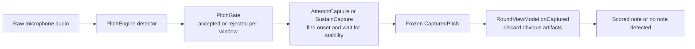

# Capture & detection — the definitive reference

**Read this before touching anything in `game/AttemptCapture.kt`, `game/SustainCapture.kt`,
`dsp/PitchGate.kt`, `ui/round/RoundViewModel.kt`, or the calibration wizard.** It records the
problem, every design decision, what worked and what didn't, and how we got there — so after a
context reset we can be current again in one read.

Last updated: 2026-07-14, after the pizz octave work: the **octave-settle** capture fix (attack
transient), the **separate pizz octave-DOWN knobs** for the sustained sympathetic-resonance octave
(§5 A), the **"ignore wrong octave"** scoring aid (§5 A′), full-config recording headers, and the
**calibration trace**.

---

## 0. Core philosophy (never violate)

This is **not a tuner**. During an exercise there is **no live pitch readout**. The model is:

> detect onset → wait for stability → freeze the FIRST stable pitch → score it.

Correcting your finger *after* the note is frozen must not change the result. Live needles exist
only on the Tune-up and Pitch-debug screens. Everything below serves this model.

### 0.1 The big picture, in plain language

If you ignore the implementation details, the app tries to answer four questions in order:

1. **Is there enough real musical signal here to trust this window at all?**
   The DSP layer looks at a short analysis window (about 23 ms) and rejects it if it looks too
   noisy, too weak, or too unlike a harmonic tone.
2. **Did the player actually start a new note just now?**
   The capture machine does not arm on any sounding pitch. For game prompts it wants a real
   **attack**: energy rising above the tracked room/instrument floor. This is what stops a
   previous note, open-string ring, or sympathetic resonance from being treated as a fresh try.
3. **Did the pitch settle long enough to count as one note?**
   After onset, the machine skips the messy first milliseconds of the attack, then waits for a
   stable pitch window. If the pitch is still sliding around, gliding, or dropping in and out,
   it keeps waiting or times out.
4. **Even if it froze a pitch, is that likely to be the note she meant?**
   The Note Accuracy game then applies note-aware rules: discard leftover ring-over, captures that
   arrived too fast to be physically plausible, harmonic artifacts, impossible low notes, and very
   faint or shaky stray transients. Only after passing that filter is the note scored.

That gives this overall pipeline:

### 0.2 What each stage is protecting against

| Stage | Main job | Mostly protects against |
|---|---|---|
| `PitchEngine` + detector | Estimate a candidate pitch from the raw waveform | Windows with no usable pitch at all |
| `PitchGate` | Reject bad windows and correct some octave-UP detector errors | Background noise, weak signal, non-harmonic junk, some missing-fundamental octave mistakes |
| `AttemptCapture` | Decide whether a new played note started and when it became stable | Ring-over, sympathetic resonance with no new attack, unstable attack transients, glides |
| `RoundViewModel.onCaptured` | Decide whether the frozen note was probably her actual attempt | Leftover previous note, too-fast artifacts, harmonic misreads, impossible low artifacts, flimsy transients |

### 0.3 The main values, translated to human meaning

These names appear throughout the code and traces. This is what they mean in practice.

| Variable / field | Plain-English meaning | Where it matters |
|---|---|---|
| `accepted` | This analysis window passed the basic trust checks and is allowed to influence capture | `PitchGate`, then every capture machine |
| `noise` | How un-pitch-like the window is. Lower is more periodic and more like a note | `PitchGate` |
| `harmonicEnergyRelative` | How much of the spectrum lines up with one harmonic series | `PitchGate` |
| `energyLevel` | Loudness-like 0..100 scale used everywhere for thresholds | `PitchGate`, `AttemptCapture`, wrong-note filter |
| `smoothedHz` | The pitch after accepted windows are smoothed and outliers dropped | Capture machines use this, not raw detector output |
| `noiseFloor` | The running estimate of what the room/instrument floor currently sounds like | `AttemptCapture` onset test |
| `quietLevel` | Below this level the room counts as quiet enough to arm in `AWAIT_QUIET` mode | `AttemptCapture` |
| `onsetRiseLevels` | How far above the current floor energy must jump to count as a fresh attack | `AttemptCapture` |
| `attackSkipMs` | Attack period intentionally ignored after onset because it is messy | `AttemptCapture` |
| `stabilityWindowMs` | How long the pitch must stay steady before freezing cleanly | `AttemptCapture` |
| `stabilityBandCents` | How narrow the pitch spread must stay inside the stability window | `AttemptCapture` |
| `captureWindowMs` | Maximum time allowed to find a stable pitch after onset | `AttemptCapture` |
| `wrongNoteMinLevel` | Minimum energy required before a wrong note is treated as a real played wrong note | `RoundViewModel.onCaptured` |
| `lowestPlayableHz` | Anything below this cannot be a real bass note and is treated as artifact | `RoundViewModel.onCaptured`, pizz octave guard |
| `missingFundamentalMaxHz` | Highest pitch where octave-down correction is even allowed because above this the mic should hear the true fundamental | `PitchGate` |
| `oddHarmonicMinRatio` / `oddHarmonicMinRelative` | How strong the 3rd-harmonic evidence must be before halving an octave-high detector read | `PitchGate` |
| `pizzOddHarmonicMinRatio` / `pizzOddHarmonicMinRelative` | Separate, looser version of the same proof for pizzicato low notes | `PitchGate` when game mode is pizz |
| `pizzOctaveSettleMs` | How long a plucked note may wait for an octave-high attack reading to settle to the true fundamental | `AttemptCapture` pizz mode |

### 0.4 Which knobs are learned in calibration, and why

The general rule is: if a threshold depends on the phone, room, bow/pluck energy, or player, the
wizard tries to measure it instead of hard-coding it.

**Measured or derived by calibration and then saved in `AppSettings`:**

| Setting | How calibration decides it | Why it exists |
|---|---|---|
| `micSensitivity` | From quiet-room ceiling versus playing floor | Sets the main energy gate so ambient noise stays out but soft playing still gets in |
| `wrongNoteMinLevel` | Derived from the same noise/play gap, but stricter than the main gate | A wrong note should only count if it had convincing playing energy |
| `lowestPlayableHz` | Set from the measured open E string pitch, with a semitone of margin | Rejects impossible low artifacts and sets the lowest allowed octave fold |
| `audioSource` | Chosen from the mic source that behaved best on this phone | Some Android sources are much more usable than others |
| `missingFundamentalMaxHz` | Found by replaying calibration takes and seeing where octave correction is still helpful | Limits octave correction to the low range where the mic may miss the fundamental |
| `oddHarmonicMinRatio` / `oddHarmonicMinRelative` | Fitted against calibration takes so low-string octave fixes work without halving genuine higher notes | Governs arco and general octave-down proof |
| `pizzOddHarmonicMinRatio` / `pizzOddHarmonicMinRelative` | Fitted separately from plucked takes | Pizz low notes need looser octave handling than arco |
| `pizzOctaveSettleMs` | Smallest tested wait window that eliminates octave-high pizz attack freezes on this rig | Handles pluck-attack octave artifacts without adding unnecessary latency on rigs that do not need it |

**Mostly code-owned behavior knobs (not user-room specific):**

| Knob | Current role |
|---|---|
| `onsetConfirmSamples` | Requires more than one accepted window before declaring onset |
| `quietMs` | Requires quiet to persist briefly before arming in `AWAIT_QUIET` mode |
| `stabilityBandCents` | Defines what counts as "steady enough" in cents |
| `maxDropouts` | Allows a short interruption before abandoning a candidate note |
| `minFallbackSamples` | Allows a SHAKY freeze if the note dies before a clean window completes |
| `promptTimeoutMs` | Stops the prompt if no onset happens in time |
| `RING_MATCH_CENTS`, `minReadMs`, harmonic tolerances | Defensive rules for discarding obviously false frozen notes in the Note Accuracy game |

### 0.5 How harmonics, resonance, and instability are kept from scoring

The current system does **not** rely on one magic check. It stacks several filters, each aimed at
one specific failure mode:

1. **Noise and weak-signal rejection** in `PitchGate` prevent random room sound from even entering
   the capture machine.
2. **Octave-down correction** in `PitchGate` fixes the classic low-string problem where the mic
   misses the fundamental and latches the octave instead.
3. **Attack-required onset** in `AttemptCapture` blocks old ringing notes and sympathetic
   resonance from becoming a new attempt if there was no fresh rise in energy.
4. **Stability waiting** in `AttemptCapture` avoids freezing the note while the attack is still
   chaotic or while the player is gliding.
5. **Pizz octave settle** gives plucked notes a short chance to drop from an octave-high attack
   reading onto the true fundamental before the note is frozen.
6. **Target-aware discard rules** in `RoundViewModel.onCaptured` throw away captures that still
   look like leftovers or detector artifacts even after all of the above.

That layered approach is the bigger picture behind the many incremental fixes: each fix landed in
the stage that actually owns that kind of mistake, instead of making one layer guess about all of
them.

---

## 1. The two gating layers (do not confuse them)

Detection happens in two stages, and it matters which layer a change belongs in:

### Layer 1 — `dsp/PitchGate` — target-AGNOSTIC, per analysis window
Lifted/adapted from Tuner. Decides, for each ~23 ms window, whether it's an acceptable pitch:
noise gate (periodicity), harmonic-energy content, absolute level vs the sensitivity threshold,
plus **octave-UP correction** (halving a detected octave error). It does **not** know what note
the user was asked to play. Shared by every screen. Emits a `PitchSample` per window.

### Layer 2 — the capture state machines — consume `PitchSample`s
- `game/AttemptCapture` — Note Accuracy & Shift. Freezes the first stable pitch.
- `game/SustainCapture` — Sustain. Tracks how long a target is held in tune.

### Layer 3 — `ui/round/RoundViewModel.onCaptured` — target-AWARE game rule
This is the only place that knows the prompted note. It decides whether a frozen pitch is
*really her attempt* or should be discarded (see §4). Target-aware logic lives here, **not** in
the target-agnostic machine — that separation is deliberate and keeps the machine reusable by
the Shift Trainer and the debug screen.

---

## 2. `AttemptCapture` — the capture state machine

`AWAIT_QUIET → LISTENING → CAPTURING → FROZEN | TIMED_OUT`. Pure state machine; all timing is on
the audio clock (sample timestamps), so it's deterministic and unit-testable with synthetic
`PitchSample` scripts. Terminal states are sticky.

Two independent arming flags (this decoupling is the crux of the whole saga — see §3):

- **`skipQuietGate`** — start in `LISTENING` immediately instead of waiting for the room to go
  quiet first. Avoids waiting for a silence that legato bowing never provides.
- **`requireOnsetRise`** — the onset must be a genuine **attack**: energy rising above the
  tracked ambient floor, not merely *any* sounding pitch. A decaying/sustained ring has no
  rising edge, so it never onsets. **This is what distinguishes "she played a note" from "a
  previous note is still ringing."**

They were originally coupled (`requireOnsetRise = !skipQuietGate`). They are now **independent**:

| Caller | skipQuietGate | requireOnsetRise | Why |
|---|---|---|---|
| **Game prompt** (Note Accuracy) | true | **true** | no silence wait (legato-friendly) AND won't grab ring-over |
| **Shift landing** | true | false | mid-glide, there is no attack to wait for — the sounding string IS the floor |
| default / legacy | false | true (=`!skipQuietGate`) | preserved for old callers |

The ambient floor is tracked from **every** sample (fast down, slow up). That's why, after a
loud note decays, the floor falls and a fresh attack can clear it, but a note held loud forever
never produces a rise.

`CapturedPitch` carries `frequencyHz`, `reactionTimeMs`, `timeToStableMs`, `quality`
(CLEAN/SHAKY), and **`energyLevel`** (median energy of the frozen window — added so Layer 3 can
reject faint captures).

### 2.1 Octave-settle (pizz attack-overtone → fundamental)
A plucked note's attack is dominated by upper partials, so the detector latches the **2nd
harmonic** and reads an **octave high** for the first ~100–530 ms, then settles onto the true
fundamental. `PitchGate`'s octave-UP correction does **not** fire here — the reads sit above the
roll-off knee and energy is rising (not a decay), so both its rules miss. The steady octave window
is long enough to satisfy stability → the machine froze it and scored a confident "right note,
wrong octave" (her 2026-07-12 Fa#1 pizz report).

Fix (`CaptureParams.octaveSettleMs`, non-null for pizz only): when a first stable pitch **could**
be an attack overtone (an octave below it is still ≥ `octaveFoldMinHz`, the calibrated lowest
playable pitch), park it as a **candidate** rather than freezing. If a stable window settles an
octave below within `octaveSettleMs`, take that (the fundamental); otherwise the candidate stands.
**Direction-safe**: it only ever folds DOWN, and only when a real stable octave-below appears — a
genuinely high note (no octave-below) keeps its pitch (proven with a synthesised F#2 stream). The
octave→fundamental transition's dropout burst is treated leniently so it doesn't SHAKY-freeze the
overtone first. `captureWindowMs` for pizz is 2500 (not 1500) so a long pluck's fundamental has
room to settle. Arco/shift leave `octaveSettleMs` null → unchanged first-stable behaviour. The
mechanism is universal and non-destructive; **whether to engage it and its window are calibrated
per rig** (see §5 A). Guarded by `PizzOctaveSettleTest` (her real Fa#1 snippet: guard off → the
octave bug reproduces; guard on → zero octave-high freezes, fundamental still captured).

---

## 3. The saga: how the "instant wrong note" bug was found and fixed

This is the part to re-read. Every step was driven by **real recordings**, not guesswork.

### 3.1 Symptom 1 — "Fa2/Fa#2 arco: no note detected" and "Do#2 sustain won't lock"
Her first hands-on gameplay feedback. Isolated debug snippets (she alternated the notes in the
Pitch-debug screen) replayed offline (`FeedbackSnippetAnalysis`) showed: **the engine detected
the notes perfectly, but the capture machine never fired.** Root cause: mid-round prompts armed
via an `AWAIT_QUIET` gate that needs the room to drop below level 30 for 200 ms. When she bows
legato, that silence never comes, so the machine sits in `AWAIT_QUIET` forever. Pizz worked
because plucks decay to silence.

### 3.2 Fix attempt #1 (WRONG, regressed) — `skipQuietGate=true`
Arm each prompt immediately, no silence wait. Fixed the "no note" — but **caused instant false
"wrong notes."** Because arming instantly with `requireOnsetRise` also off (they were coupled),
the machine froze whatever was already sounding: **the previous note still ringing.**

### 3.3 The instrument that cracked it — the game-trace tool (her idea)
Isolated debug snippets couldn't show the *between-prompt* dynamics. So we built
`audio/GameTrace` (Settings → Debug → "Record & trace games"): records the **whole game** — full
per-sample detection stream + game events (prompt shown w/ timestamp, each freeze, each discard
with its reason) + the raw audio. Replaying the audio through `PitchEngine.wavSamples`
reconstructs detection exactly; the event log lines game decisions up against it.

**This is the workflow for any future detection issue: turn trace on, play a real round, pull
the newest `game-trace-*` off the phone, analyse events + samples, fix, re-run.**

### 3.4 What the traces proved
- Trace 1 (`…194019`): 10 prompts. You play E2 well on prompt 8 (+10¢); that **E2 keeps ringing
  at level 65–100 through prompts 9 AND 10** and is frozen both times (+289¢, then −610¢
  "wrong"). The false captures landed **0.35–0.8 s** after the prompt; your *genuine* correct
  plays measured **2.4–5.0 s**. Ring-over, confirmed.

### 3.5 Fix attempt #2 (partial) — ring-over + "too soon" rejection
In `onCaptured`: discard a capture that (a) matches the **previous** answer's pitch and isn't
near the current target (ring-over), or (b) arrives sooner than she could physically read the
new note and play it (**her physical-impossibility insight** — an off-target capture in a
fraction of a second is never her attempt). The read-time floor is per-player (see §5).
Traces 2/3 showed this cleared the fast cases but a **loud ring/decay past the floor** (the open
A string resonating at level 100, "I didn't even play, just let it ring") still slipped: it
wasn't near the previous pitch (decay had shifted it) and wasn't too-soon (>1 s).

### 3.6 Fix attempt #3 (THE fix) — require a genuine attack
Decoupled `requireOnsetRise` from `skipQuietGate` and set **both true** for game prompts. The
distinguishing fact was never timing or pitch — it's that **a ring has no new attack. She wasn't
playing.** With `requireOnsetRise=true`, a decaying/sustained ring produces no rising edge, so it
never onsets and never captures; only a real attack does.

**Verified** on a full mixed run: 10 prompts, correct notes scored, deliberate wrong notes
flagged ("wrong note?" / "right note, wrong octave"), and letting a note ring produced **zero
captures** (the trace showed zero discard events — the ring never even onset). Commits `3f34e0c`
(ring-over/too-soon) and `f65497b` (attack requirement).

### 3.7 What did NOT work, and why (so we never re-try these)
- **`AWAIT_QUIET` silence gate** for mid-round prompts → starves under legato (no silence).
- **`skipQuietGate` with the rise requirement off** → grabs the previous note's ring-over.
- **A read-time floor alone** → a loud ring outlasts any fixed floor.
- **Ring-over pitch-match alone** → decay shifts the pitch out of the match window.
- **The winning signal is attack detection** (energy rising edge). The others are useful backups
  but not sufficient alone.

---

## 4. `onCaptured` — the wrong-note filter (Layer 3, Note Accuracy)

A frozen pitch is discarded (and the machine keeps listening within the prompt) when it is
clearly not the note she meant. In priority of concept:

1. **Ring-over** — matches the previous prompt's answer pitch (`RING_MATCH_CENTS`=60) and isn't
   near the current target.
2. **Too soon** — arrived before `minReadMs` (she couldn't have read + played yet). Applies to
   ANY pitch, near-target included (that gap once let a semitone-away ring score).
3. **Harmonic artifact** (her idea) — a **non-octave integer overtone** of the target (×3, ×5,
   ×6, ×7, ×9, ×10). She aims at the target, so an overtone reading is the detector latching a
   harmonic, not a note anyone plays by mistake. **Octaves (×2, ×4) are the exception** — a wrong
   octave is a plausible misread, reported as **"right note, wrong octave"** (`wrongOctave`).
4. **Unplayable** — below the lowest string (`lowestPlayableHz`) — a subharmonic/correction
   artifact.
5. **Flimsy** — faint (`energyLevel < wrongNoteMinLevel`) or SHAKY quality.

A confidently-played, on-time, non-artifact wrong note **is** reported ("wrong note?") — we must
never swallow a genuine mistake. If an artifact/ring persists past `MAX_DISCARDS` (25), report
"no note detected" rather than the artifact. Every discard is logged to the trace with its
reason.

**With the §3.6 attack requirement in place, most of these rarely fire** — the ring simply never
onsets. They remain as defence-in-depth.

### 4.1 Same filter, reused by the Chords (arpeggio) game

`game/ArpeggioCapture` plays a triad tone-by-tone by composing one `AttemptCapture` per tone
(each armed `skipQuietGate=true, requireOnsetRise=true`, exactly like Note Accuracy) — the same
way `ShiftCapture` composes its sub-captures. It carries a **copy of the §4 discard filter**
(ring-over/too-soon/harmonic/unplayable/flimsy) as a pure, parameterized function inside the
machine (thresholds passed in by the ViewModel from the same calibration/player sources), so it
stays Android-free and unit-tested (`ArpeggioCaptureTest`). Two arpeggio-specific rules:
- **Ring-over is against the *previous tone of the same arpeggio*** (not the previous prompt) —
  this is the dominant risk here because the tone she just played is still sounding when the
  next tone arms. `too-soon` (`minReadMs`) applies to the **root only**; later tones follow
  immediately.
- Strict ascending order: a genuine wrong **root** re-arms ("that's not it", like the shift
  start); a genuine wrong **third/fifth** is scored as a miss and advances (never stuck).

These thresholds are **provisional** — reused from Note Accuracy, not yet retuned against a real
arpeggio game-trace. Get one via Settings → Debug "Record & trace games" (tag `chords-*`) and
replay offline before trusting them. If the filter ever needs a third caller, that's the trigger
to extract it to one shared pure function (see §8) rather than keep a third copy.

---

## 5. Threshold ownership — who sets what (settled WITH the user)

The guiding principle she set: **calibrate what depends on the device/room/player; hard-code only
true universals.** Three homes:

### A. Detection thresholds → the calibration wizard (per phone / room / instrument)
Persisted in `AppSettings`, applied via `settings.applying(config)` (the single settings→config
point). Measured by the full calibration wizard from prompted notes (ground truth known):
- **noise gate** (`micSensitivity`) — from room-noise ceiling vs playing floor.
- **`wrongNoteMinLevel`** — energy floor for the "flimsy" rule. Sits **halfway** between measured
  noise and playing (the gate sits ⅓ up, favouring hearing soft notes; calling something a
  *wrong note* demands clearer energy). `CalibrationAnalysis.wrongNoteFloor(noiseCeil, playingFloor)`.
- **`lowestPlayableHz`** — a semitone below the lowest open string's known pitch, so it tracks her
  A4 / tuning. `CalibrationAnalysis.lowestPlayableHz(lowestOpenStringHz)`. Also the `octaveFoldMinHz`
  floor for the pizz octave-settle guard (§2.1).
- **`pizzOctaveSettleMs`** — the pizz octave-settle window (§2.1). **Measured per rig**, not
  assumed: the wizard's pizz phase replays the recorded plucked takes through the game capture
  under each `PIZZ_SETTLE_CANDIDATES` window (`[0, 200, 300, 400] ms`, 0 = off) and picks the
  smallest that lands zero octave-high captures on THIS rig (`CalibrationAnalysis.choosePizzSettle`).
  A rig with no attack-octave artifact gets 0 (no guard, no added latency). The shipped default
  (300) is only the reference-Pixel-6a measurement — a rig assumption that calibration replaces,
  exactly like the odd-harmonic thresholds. (This is the answer to "don't hard-code your rig".)
- **mic source** (Standard/Voice/Unprocessed), **roll-off knee** (`missingFundamentalMaxHz`),
  **octave-correction odd-harmonic thresholds** — as before.
- **pizz octave-down knobs** (`pizzOddHarmonicMinRatio` / `pizzOddHarmonicMinRelative`) — **separate
  from the arco/high-note thresholds** (her call, 2026-07-13). A plucked low note reads an octave
  high far more readily than a bowed one: a weak fundamental plus a 2nd harmonic **boosted by
  sympathetic resonance of the other open strings** (once they ring, low Mi latches Mi2 and stays
  there — a *sustained* octave the §2.1 settle can't fix, because there's no fundamental to settle
  to). Pizz therefore needs a **looser** odd-harmonic octave-DOWN proof than arco; forcing one
  value would be too loose for arco (halves genuine Do3/Ré3) or too strict for pizz. `applying(
  settings, pizz)` picks the pizz set when the game mode is pizz (each game VM passes
  `pizz = mode == "pizz"`; arco/live screens use the strict set). The wizard's pizz phase fits the
  pizz set from the plucked takes: `CalibrationAnalysis.choosePizzOctaveFit` replays each take under
  `PIZZ_OCTAVE_CANDIDATES` (strict→loose) and picks the loosest that clears the octave-HIGH reads
  without halving any genuine pizz note (octaveDownRate ≤ 5%), ties to the strictest. Validated per
  rig against ground-truth calibration takes (arco strings + Do3 + pizz strings). On the reference
  rig it lands ratio 1.2 / rel 0.01–0.015 (pizz octave 28%→~0, no note halved); guarded by
  `PizzOctaveDownTest` (real snippet: arco knobs leave the octave, pizz knobs collapse it) and
  `WizardCorpusTest` (the chooser logic). This is the "better discriminator with calibration knobs"
  — the time-based §2.1 settle handles the *attack-transient* octave, this handles the *sustained
  resonance* octave.

Defaults in `AppSettings` are the reference-Pixel-6a values; the wizard overrides per device.

**Recording headers now carry the FULL detection config** (`PitchEngineConfig.toJson()` in every
snippet/game-trace/calibration-trace header, not just gate+source) — so a recording replays offline
*exactly* as the rig ran it. This closed a real reproduction gap (octave correction is
config-dependent; the old 6-field header couldn't reproduce her rig). The **calibration trace**
(Settings → Debug "Record & trace games" → run the wizard) saves every ground-truth take
(`calibration-<stage>-<midi>-*`) with its target and full config — the per-rig data used to fit AND
validate octave handling without hard-coding a rig.

### A′. Practice aid, NOT calibration — "ignore wrong octave" (`ignoreWrongOctave`, default on)
Layer 3 (`resultFor`): when a capture is the right pitch class but a whole octave off, fold it onto
the target octave and score the intonation there instead of a miss. Detection still occasionally
reads a plucked low note an octave high (the mechanism above); this keeps that from punishing a
correctly-played note. It folds the *frozen pitch*, never the target, and only for exact-octave
errors (`OCTAVE_TOLERANCE_CENTS`). It's a scoring-forgiveness toggle, orthogonal to the detection
fixes — the detection work above still aims to make it unnecessary.

### B. Player-facing timing → `PlayerLevel` (auto-tuned by `LevelAdvisor`)
- **`minReadMs`** — the read-time floor used by "too soon". It's her **reading speed**, not a mic
  property, so it belongs to the player level, NOT the detection wizard. Beginner 1000 / Int 800 /
  Adv 600 / Expert 450 ms. Her genuine reads measured 2.4 s+, so there is wide margin.
  `LevelAdvisor` already suggests a level from measured reaction times.
- prompt/reveal/shift/sustain timeouts, reveal factor — same rationale.

### C. Universal musical constants → hard-coded, NOT calibrated
- `NON_OCTAVE_HARMONICS = {3,5,6,7,9,10}` — an overtone is an overtone on every phone.
- `RING_MATCH_CENTS`=60, `NEAR_TARGET_CENTS`=150 — a semitone is a semitone everywhere.
- Calibrating these per-device would be meaningless (pushback stands).

---

## 6. `SustainCapture` — hold-in-tune machine

Separate machine. Requires onset-rise already (a ring won't start it). Key behaviour:
- **Bow-reversal forgiveness** (her "classifier" idea, heuristic form): an out-of-tolerance
  excursion that **returns** within `outGraceMs` (250 ms) does not reset the hold timer; a
  **sustained** departure does. A bow reversal briefly scoops the pitch then returns to the same
  note; genuine finger drift persists. (Energy-dip refinement is available later from a sustain
  trace if needed.)
- The Sustain screen shows a **tune-up-style in-tune bar** that greys out below the noise gate.

---

## 7. The calibration wizard — measure, validate, test-run, then save

`ui/calibrate/WizardViewModel` + pure core `calibration/CalibrationAnalysis`. Flow (~2 min):
quiet room → gate; open Mi once per mic source → best source; open La/Ré/Sol → playing floor +
roll-off knee; Do3 → verify + refit octave thresholds only if it halves; **then a pizz phase —
pluck the four open strings → `choosePizzSettle` measures the octave-settle window for this rig**
(§2.1, §5 A). Every prompted note's true pitch is known, so takes are **replayed offline through
candidate configs** and scored against ground truth ("turning the knobs against known notes").

**UX (2026-07-12):** each play prompt **auto-starts recording after a short countdown** (no
putting the bass down to tap a button — her request), with a "Start now" override, and the
prompt text is sized to read from ~2 m while holding the bass. The pizz rows and any residual
"octave drift" warning show in the summary.

Robustness (her requirements — reject bad data, don't bake in a one-off, validate with a test
run):
- **`isUsableTake`** — a take is accepted only if it has enough signal AND actually contains the
  asked-for note (at some octave — low strings may read octave-up on a rolled-off mic).
  Rejects wrong-note / wrong-string / noise takes → **asks her to play it again** (the retry path
  IS "repeat the action" until the data is clean).
- **Test-run save guard** — before saving, every take is replayed under the **final** config and
  verified; if any **core open string** fails to detect, the wizard **refuses to save** and asks
  her to re-run. Bad data can never become saved settings. (The high note is allowed to be
  unreliable; that's surfaced separately, not blocking.)
- A too-noisy room (gate OVERLAP) already refuses to save.

Not yet done (candidate future work): explicit N-take **consensus/median** per note (record each
2–3× and aggregate) for extra one-off protection — deferred as a UX/time trade-off; the 5 s takes
already pool ~170 windows each and the retry+guard cover the main risk.

---

## 8. Test coverage (the safety net)

- `app` `AttemptCaptureTest` — the state machine incl. the **attack-requirement** cases (a ring
  with no attack must not freeze; a genuine attack must; an attack after a ring decays must).
- `app` `PizzOctaveSettleTest` — the pizz **octave-settle** fix (§2.1), replaying her real Fa#1
  pizz snippet's recorded detection stream (JSONL, not a WAV re-run — octave correction is
  config-dependent, so the recorded stream is the faithful ground truth): guard off reproduces
  the octave bug, guard on eliminates it, and `choosePizzSettle` picks a resolving window.
- `dsp` `PizzOctaveDownTest` — the **separate pizz octave-DOWN knobs** (§5 A) against her real
  sympathetic-resonance snippet under its recorded config: the arco knobs leave the sustained
  octave read (>10%), the pizz knobs collapse it (<2%). `WizardCorpusTest` locks the per-rig
  `choosePizzOctaveFit` decision (loosest-safe; strict fallback when nothing clears).
- `app` `FeedbackRegressionTest` — replays her Sol#1/Fa2 snippets; guards the harmonic/unplayable
  /flimsy filters and legato arming.
- `app` `SustainCaptureTest` — incl. `briefBowReversalScoopDoesNotReset`.
- `app` `NoiseRejectionTest` — desk/bird noise must never produce a capture.
- `app` `calibration/WizardCorpusTest` — grounds the wizard's decisions in the corpus: roll-off
  knee ≈ 63 Hz, default octave thresholds win on the reference phone, `wrongNoteFloor` lands above
  the gate in a sane band, `lowestPlayableHz` ≈ a semitone under E1, `isUsableTake` accepts a real
  open string and rejects the wrong note.
- `dsp` `RealBassRegressionTest`, `OctaveCorrectionEvidence`, etc. — the octave-correction corpus.

Corpus lives in `dsp/src/test/resources/wav/` (WAV float32 + JSONL). The `:app` tests read it via
sourceSets. Full-round game traces are large; they live locally in `.trace-incoming/` (untracked)
and can become a round-replay regression if the `onCaptured` decision is extracted to a pure fn.

---

## 9. Diagnosing a future detection problem (the drill)

1. Ask her to reproduce with **trace on** (Settings → Debug → Record & trace games), play a round,
   note which prompts misbehaved.
2. Pull the newest `game-trace-*.jsonl` (+`.wav`) from
   `/sdcard/Android/data/be.drakarah.intonation/files/snippets/` via adb.
3. Read the `event` lines: `prompt` (t, target midi, previous pitch), `result` (cents, wrong,
   timeout), `discard` (hz, quality, level, elapsed-ms, ring/soon/harm flags). Correlate her
   read→play timing against captures.
4. If a DSP change is needed, replay the `.wav` through `PitchEngine.wavSamples` under candidate
   configs (that's exactly what the wizard and corpus tests do).
5. Fix, add a regression test from the recording, re-run on device, confirm from a fresh trace.

**The signal hierarchy that actually worked, in order:** genuine attack (energy rise) > ring-over
pitch-match > read-time floor > energy/harmonic/unplayable artifact checks. Reach for attack
detection first.
