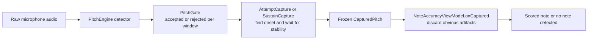

# Capture & detection — the definitive reference

**Read this before touching anything in `game/AttemptCapture.kt`, `game/SustainCapture.kt`,
`dsp/PitchGate.kt`, `ui/noteaccuracy/NoteAccuracyViewModel.kt`, or the calibration wizard.** It records the
problem, every design decision, what worked and what didn't, and how we got there — so after a
context reset we can be current again in one read.

Last updated: 2026-07-19, adding **§12 — the odd-harmonic octave-DOWN proof is now ARCO-ONLY** (it
falsely halved correctly-fingered pizz E2/G2 whose octave-below open string rings sympathetically; pizz
now relies on the decay-continuation rule, which handles every genuine pizz octave-up in the corpus —
her "mi2 said wrong note though it was right" report). This **reverses the §5 A "pizz needs looser
odd-harmonic" premise** — read §12 if pizz octaves regress. Also earlier today: **§11 — the
game-trace file-format reference** (line types, every
event's field schema per game, symptom→where-to-look recipes, and §11.2.1's accept/reject + octave
decision rules) so agents stop re-deriving the trace structure from source each time — plus a **Tier-1
trace enrichment** the reference already documents: the `result` event now carries the frozen pitch and
timing (`played`/`wrongOct`/`react`/`stable`/`wob`; Shift `landHz`/`wob`), the Note-Accuracy `discard`
logs all five reason bools (added `flimsy`/`unplay`), and the header gained a `context` block
(`a4`/`difficulty`/`minReadMs`) so cents/too-soon/wrong-note are recomputable from the trace alone.
Before that, the **pizz/arco play-style classifier** (§10): detect when she plays
pizzicato in an arco exercise (or vice versa) from the attack SHAPE — a bowed onset crescendos, a
pluck steps in. Per-rig threshold set + graded (GOOD/TIGHT/OVERLAP) by the calibration wizard from
its labeled arco/pizz takes; the classification is logged per note into the game trace for
false-positive monitoring. The in-game warning is deferred. Earlier: the **pizz capture-timing** work:
the plucked attack reads sharp and
settles flatter, so the shipped 60/150 lock could freeze the transient and score a pizz note ~10–20¢
sharp (her pizz-accuracy report, verified from full game traces). Fixed by making the pizz
attack-skip and stability-window **calibration-owned per rig** (§2.2), measured by the wizard's pizz
phase which now also records **stopped (fingered) notes** (§7). Earlier: the pizz **octave-settle**
capture fix (attack transient, §2.1), the **separate pizz octave-DOWN knobs** for the sustained
sympathetic-resonance octave (§5 A), the **"ignore wrong octave"** scoring aid (§5 A′), full-config
recording headers, and the **calibration trace**.

---

## 0. Core philosophy (never violate)

This is **not a tuner**. During an exercise there is **no live pitch readout**. The model is:

> detect onset → wait for stability → freeze the FIRST stable pitch → score it.

Correcting your finger *after* the note is frozen must not change the result. Live needles exist
only on the Tune-up and Pitch-debug screens. Everything below serves this model.

### 0.1 The big picture, in plain language

If you ignore the implementation details, the app tries to answer four questions in order:

1. **Is there enough real musical signal here to trust this window at all?**
   The DSP layer looks at a short analysis window (about 23 ms) and rejects it if it looks too
   noisy, too weak, or too unlike a harmonic tone.
2. **Did the player actually start a new note just now?**
   The capture machine does not arm on any sounding pitch. For game prompts it wants a real
   **attack**: energy rising above the tracked room/instrument floor. This is what stops a
   previous note, open-string ring, or sympathetic resonance from being treated as a fresh try.
3. **Did the pitch settle long enough to count as one note?**
   After onset, the machine skips the messy first milliseconds of the attack, then waits for a
   stable pitch window. If the pitch is still sliding around, gliding, or dropping in and out,
   it keeps waiting or times out.
4. **Even if it froze a pitch, is that likely to be the note she meant?**
   The Note Accuracy game then applies note-aware rules: discard leftover ring-over, captures that
   arrived too fast to be physically plausible, harmonic artifacts, impossible low notes, and very
   faint or shaky stray transients. Only after passing that filter is the note scored.

That gives this overall pipeline:



### 0.2 What each stage is protecting against

| Stage | Main job | Mostly protects against |
|---|---|---|
| `PitchEngine` + detector | Estimate a candidate pitch from the raw waveform | Windows with no usable pitch at all |
| `PitchGate` | Reject bad windows and correct some octave-UP detector errors | Background noise, weak signal, non-harmonic junk, some missing-fundamental octave mistakes |
| `AttemptCapture` | Decide whether a new played note started and when it became stable | Ring-over, sympathetic resonance with no new attack, unstable attack transients, glides |
| `NoteAccuracyViewModel.onCaptured` | Decide whether the frozen note was probably her actual attempt | Leftover previous note, too-fast artifacts, harmonic misreads, impossible low artifacts, flimsy transients |

### 0.3 The main values, translated to human meaning

These names appear throughout the code and traces. This is what they mean in practice.

| Variable / field | Plain-English meaning | Where it matters |
|---|---|---|
| `accepted` | This analysis window passed the basic trust checks and is allowed to influence capture | `PitchGate`, then every capture machine |
| `noise` | How un-pitch-like the window is. Lower is more periodic and more like a note | `PitchGate` |
| `harmonicEnergyRelative` | How much of the spectrum lines up with one harmonic series | `PitchGate` |
| `energyLevel` | Loudness-like 0..100 scale used everywhere for thresholds | `PitchGate`, `AttemptCapture`, wrong-note filter |
| `smoothedHz` | The pitch after accepted windows are smoothed and outliers dropped | Capture machines use this, not raw detector output |
| `noiseFloor` | The running estimate of what the room/instrument floor currently sounds like | `AttemptCapture` onset test |
| `quietLevel` | Below this level the room counts as quiet enough to arm in `AWAIT_QUIET` mode | `AttemptCapture` |
| `onsetRiseLevels` | How far above the current floor energy must jump to count as a fresh attack | `AttemptCapture` |
| `attackSkipMs` | Attack period intentionally ignored after onset because it is messy | `AttemptCapture` |
| `stabilityWindowMs` | How long the pitch must stay steady before freezing cleanly | `AttemptCapture` |
| `stabilityBandCents` | How narrow the pitch spread must stay inside the stability window | `AttemptCapture` |
| `captureWindowMs` | Maximum time allowed to find a stable pitch after onset | `AttemptCapture` |
| `wrongNoteMinLevel` | Minimum energy required before a wrong note is treated as a real played wrong note | `NoteAccuracyViewModel.onCaptured` |
| `WRONG_NOTE_CENTS` | How far off the target a frozen pitch may be and still count as an *attempt at that note* (scored, feeds intonation/drift). Beyond it the capture is a different note — flagged `wrongNote`, counted as a note-finding miss, kept OUT of intonation | `Scoring.kt`; every game VM's classification |
| `lowestPlayableHz` | Anything below this cannot be a real bass note and is treated as artifact | `NoteAccuracyViewModel.onCaptured`, pizz octave guard |
| `missingFundamentalMaxHz` | Highest pitch where octave-down correction is even allowed because above this the mic should hear the true fundamental | `PitchGate` |
| `oddHarmonicMinRatio` / `oddHarmonicMinRelative` | How strong the 3rd-harmonic evidence must be before halving an octave-high detector read | `PitchGate` |
| `pizzOddHarmonicMinRatio` / `pizzOddHarmonicMinRelative` | Separate, looser version of the same proof for pizzicato low notes | `PitchGate` when game mode is pizz |
| `pizzOctaveSettleMs` | How long a plucked note may wait for an octave-high attack reading to settle to the true fundamental | `AttemptCapture` pizz mode |
| `pizzAttackSkipMs` / `pizzStabilityWindowMs` | Pizz-only, calibration-owned override of `attackSkipMs` / `stabilityWindowMs`: how long the pluck attack is skipped and held steady before freezing, so the note is scored where it settles, not on its sharp attack | `AttemptCapture` pizz mode |

### 0.4 Which knobs are learned in calibration, and why

The general rule is: if a threshold depends on the phone, room, bow/pluck energy, or player, the
wizard tries to measure it instead of hard-coding it.

**Measured or derived by calibration and then saved in `AppSettings`:**

| Setting | How calibration decides it | Why it exists |
|---|---|---|
| `micSensitivity` | From quiet-room ceiling versus playing floor | Sets the main energy gate so ambient noise stays out but soft playing still gets in |
| `wrongNoteMinLevel` | Derived from the same noise/play gap, but stricter than the main gate | A wrong note should only count if it had convincing playing energy |
| `lowestPlayableHz` | Set from the measured open E string pitch, with a semitone of margin | Rejects impossible low artifacts and sets the lowest allowed octave fold |
| `audioSource` | Chosen from the mic source that behaved best on this phone | Some Android sources are much more usable than others |
| `missingFundamentalMaxHz` | Found by replaying calibration takes and seeing where octave correction is still helpful | Limits octave correction to the low range where the mic may miss the fundamental |
| `oddHarmonicMinRatio` / `oddHarmonicMinRelative` | Fitted against calibration takes so low-string octave fixes work without halving genuine higher notes | Governs arco and general octave-down proof |
| `pizzOddHarmonicMinRatio` / `pizzOddHarmonicMinRelative` | Fitted separately from plucked takes | Pizz low notes need looser octave handling than arco |
| `pizzOctaveSettleMs` | Smallest tested wait window that eliminates octave-high pizz attack freezes on this rig | Handles pluck-attack octave artifacts without adding unnecessary latency on rigs that do not need it |
| `pizzAttackSkipMs` / `pizzStabilityWindowMs` | Smallest tested pizz capture timing whose freeze lands on the note's *settled* pitch (not its sharp attack) on this rig | A pluck reads sharp and settles flatter; the shipped 60/150 can freeze the transient and score sharp. Measured from open + stopped plucked takes (§2.2) |

**Mostly code-owned behavior knobs (not user-room specific):**

| Knob | Current role |
|---|---|
| `onsetConfirmSamples` | Requires more than one accepted window before declaring onset |
| `quietMs` | Requires quiet to persist briefly before arming in `AWAIT_QUIET` mode |
| `stabilityBandCents` | Defines what counts as "steady enough" in cents |
| `attackSkipMs` / `stabilityWindowMs` (arco) | Fixed arco preset (120/250) — a bowed onset is gradual and stable, so no per-rig timing is needed (pizz's are calibrated, §2.2) |
| `maxDropouts` | Allows a short interruption before abandoning a candidate note |
| `minFallbackSamples` | Allows a SHAKY freeze if the note dies before a clean window completes |
| `promptTimeoutMs` | Stops the prompt if no onset happens in time |
| `RING_MATCH_CENTS`, `minReadMs`, harmonic tolerances | Defensive rules for discarding obviously false frozen notes in the Note Accuracy game |

### 0.5 How harmonics, resonance, and instability are kept from scoring

The current system does **not** rely on one magic check. It stacks several filters, each aimed at
one specific failure mode:

1. **Noise and weak-signal rejection** in `PitchGate` prevent random room sound from even entering
   the capture machine.
2. **Octave-down correction** in `PitchGate` fixes the classic low-string problem where the mic
   misses the fundamental and latches the octave instead.
3. **Attack-required onset** in `AttemptCapture` blocks old ringing notes and sympathetic
   resonance from becoming a new attempt if there was no fresh rise in energy.
4. **Stability waiting** in `AttemptCapture` avoids freezing the note while the attack is still
   chaotic or while the player is gliding.
5. **Pizz octave settle** gives plucked notes a short chance to drop from an octave-high attack
   reading onto the true fundamental before the note is frozen.
6. **Target-aware discard rules** in `NoteAccuracyViewModel.onCaptured` throw away captures that still
   look like leftovers or detector artifacts even after all of the above.

That layered approach is the bigger picture behind the many incremental fixes: each fix landed in
the stage that actually owns that kind of mistake, instead of making one layer guess about all of
them.

---

## 1. The two gating layers (do not confuse them)

Detection happens in two stages, and it matters which layer a change belongs in:

### Layer 1 — `dsp/PitchGate` — target-AGNOSTIC, per analysis window
Lifted/adapted from Tuner. Decides, for each ~23 ms window, whether it's an acceptable pitch:
noise gate (periodicity), harmonic-energy content, absolute level vs the sensitivity threshold,
plus **octave-UP correction** (halving a detected octave error). It does **not** know what note
the user was asked to play. Shared by every screen. Emits a `PitchSample` per window.

### Layer 2 — the capture state machines — consume `PitchSample`s
- `game/AttemptCapture` — Note Accuracy & Shift. Freezes the first stable pitch.
- `game/SustainCapture` — Sustain. Tracks how long a target is held in tune.

### Layer 3 — the target-AWARE discard filter, now in the domain
This is the only layer that knows the prompted note. It decides whether a frozen pitch is
*really her attempt* or should be discarded (see §4). It is a **single pure function**,
`game/CaptureFilter.kt` (`captureFilter()` + `CaptureFilterConfig`), used by every game — no copies.
Note Accuracy's whole capture pipeline (classification + octave-fold + this filter + the re-arm
loop) lives in the domain state machine `game/NoteAttemptCapture` (mirrors `ArpeggioCapture` /
`ShiftCapture`); `NoteAccuracyViewModel` is a thin adapter. (This replaced the old
`NoteAccuracyViewModel.onCaptured`, which was untestable while it lived in the UI — see §4/§8.)
Target-aware logic stays out of the target-agnostic capture machine (`AttemptCapture`) — that
separation is deliberate and keeps the machine reusable by every game and the debug screen.

---

## 2. `AttemptCapture` — the capture state machine

`AWAIT_QUIET → LISTENING → CAPTURING → FROZEN | TIMED_OUT`. Pure state machine; all timing is on
the audio clock (sample timestamps), so it's deterministic and unit-testable with synthetic
`PitchSample` scripts. Terminal states are sticky.

Two independent arming flags (this decoupling is the crux of the whole saga — see §3):

- **`skipQuietGate`** — start in `LISTENING` immediately instead of waiting for the room to go
  quiet first. Avoids waiting for a silence that legato bowing never provides.
- **`requireOnsetRise`** — the onset must be a genuine **attack**: energy rising above the
  tracked ambient floor, not merely *any* sounding pitch. A decaying/sustained ring has no
  rising edge, so it never onsets. **This is what distinguishes "she played a note" from "a
  previous note is still ringing."**

They were originally coupled (`requireOnsetRise = !skipQuietGate`). They are now **independent**:

| Caller | skipQuietGate | requireOnsetRise | Why |
|---|---|---|---|
| **Game prompt** (Note Accuracy) | true | **true** | no silence wait (legato-friendly) AND won't grab ring-over |
| **Shift landing** | true | false | mid-glide, there is no attack to wait for — the sounding string IS the floor |
| default / legacy | false | true (=`!skipQuietGate`) | preserved for old callers |

The ambient floor is tracked from **every** sample (fast down, slow up). That's why, after a
loud note decays, the floor falls and a fresh attack can clear it, but a note held loud forever
never produces a rise.

`CapturedPitch` carries `frequencyHz`, `reactionTimeMs`, `timeToStableMs`, `quality`
(CLEAN/SHAKY), and **`energyLevel`** (median energy of the frozen window — added so Layer 3 can
reject faint captures).

### 2.1 Octave-settle (pizz attack-overtone → fundamental)
A plucked note's attack is dominated by upper partials, so the detector latches the **2nd
harmonic** and reads an **octave high** for the first ~100–530 ms, then settles onto the true
fundamental. `PitchGate`'s octave-UP correction does **not** fire here — the reads sit above the
roll-off knee and energy is rising (not a decay), so both its rules miss. The steady octave window
is long enough to satisfy stability → the machine froze it and scored a confident "right note,
wrong octave" (her 2026-07-12 Fa#1 pizz report).

Fix (`CaptureParams.octaveSettleMs`, non-null for pizz only): when a first stable pitch **could**
be an attack overtone (an octave below it is still ≥ `octaveFoldMinHz`, the calibrated lowest
playable pitch), park it as a **candidate** rather than freezing. If a stable window settles an
octave below within `octaveSettleMs`, take that (the fundamental); otherwise the candidate stands.
**Direction-safe**: it only ever folds DOWN, and only when a real stable octave-below appears — a
genuinely high note (no octave-below) keeps its pitch (proven with a synthesised F#2 stream). The
octave→fundamental transition's dropout burst is treated leniently so it doesn't SHAKY-freeze the
overtone first. `captureWindowMs` for pizz is 2500 (not 1500) so a long pluck's fundamental has
room to settle. Arco/shift leave `octaveSettleMs` null → unchanged first-stable behaviour. The
mechanism is universal and non-destructive; **whether to engage it and its window are calibrated
per rig** (see §5 A). Guarded by `PizzOctaveSettleTest` (her real Fa#1 snippet: guard off → the
octave bug reproduces; guard on → zero octave-high freezes, fundamental still captured).

### 2.2 Pizz capture timing (attack settles flat → don't freeze the transient)
A plucked note's attack is not only octave-rich (§2.1) — its **pitch reads sharp and settles flatter**
over the first ~150–300 ms as string tension equalises. The shipped pizz preset (`attackSkipMs=60`,
`stabilityWindowMs=150`) can put the earliest freeze ~210 ms after onset, sometimes still inside that
transient, and the 10-cent stability band can lock onto the *top of a pitch wobble* that then relaxes.
Result: a correctly-played pizz note scored **~10–20 ¢ sharp** — a directional bias, not noise (her
2026-07-15 pizz-accuracy report, verified by replaying full game traces: short/loud attacks scored
sharp, long-held notes were accurate).

Fix: the pizz **attack-skip and stability-window are now calibration-owned per rig**
(`AppSettings.pizzAttackSkipMs` / `pizzStabilityWindowMs`, applied for pizz only via the shared
`CaptureParams.applying(settings, pizz)` so **every** capture game — Note Accuracy, Shift, Chords —
freezes on the same rig timing; arco keeps its preset). Originally only `NoteAccuracyViewModel` applied
it, which silently left Shift and Chords on the raw 60/150 defaults and froze pizz landings on the
attack transient (2026-07-15) — the single builder is what prevents that per-game drift. The wizard's pizz phase replays the recorded plucked takes through the real
game capture under each `CalibrationAnalysis.PIZZ_TIMING_CANDIDATES` (60/150 … 200/300, least added
latency first) and picks the **smallest** whose frozen pitch lands within
`PIZZ_TIMING_TOLERANCE_CENTS` (8 ¢) of where the note actually **settles** — `settledPitchHz`, the
robust median of each take's *latter* sustain, folded to the nominal octave, so it is self-referential
ground truth that works even for a stopped note played a few cents off. A rig whose pluck settles
instantly keeps 60/150 (no added latency); a rig that can't settle within tolerance under any
candidate uses the slowest as best effort (`resolved=false`, surfaced in the summary). On the
reference Pixel 6a it lands **200/200** (worst freeze error 10–18 ¢ → ~3 ¢). Guarded by
`WizardCorpusTest`. The shipped defaults stay 60/150 (reference preset, overridden on calibration) —
**re-run the wizard to pick up per-rig timing.**

**Arco is deliberately NOT calibrated this way and does not need to be:** a bow ramps the note up
gradually and the pitch is stable once engaged (no percussive sharp-then-settle), and the arco preset
is already more forgiving (`attackSkipMs=120`, `stabilityWindowMs=250` → earliest freeze ~370 ms). Her
real arco traces score within a median ~3 ¢ of where notes settle. Arco keeps the hard-coded preset.

---

## 3. The saga: how the "instant wrong note" bug was found and fixed

This is the part to re-read. Every step was driven by **real recordings**, not guesswork.

### 3.1 Symptom 1 — "Fa2/Fa#2 arco: no note detected" and "Do#2 sustain won't lock"
Her first hands-on gameplay feedback. Isolated debug snippets (she alternated the notes in the
Pitch-debug screen) replayed offline (`FeedbackSnippetAnalysis`) showed: **the engine detected
the notes perfectly, but the capture machine never fired.** Root cause: mid-round prompts armed
via an `AWAIT_QUIET` gate that needs the room to drop below level 30 for 200 ms. When she bows
legato, that silence never comes, so the machine sits in `AWAIT_QUIET` forever. Pizz worked
because plucks decay to silence.

### 3.2 Fix attempt #1 (WRONG, regressed) — `skipQuietGate=true`
Arm each prompt immediately, no silence wait. Fixed the "no note" — but **caused instant false
"wrong notes."** Because arming instantly with `requireOnsetRise` also off (they were coupled),
the machine froze whatever was already sounding: **the previous note still ringing.**

### 3.3 The instrument that cracked it — the game-trace tool (her idea)
Isolated debug snippets couldn't show the *between-prompt* dynamics. So we built
`audio/GameTrace` (Settings → Debug → "Record & trace games"): records the **whole game** — full
per-sample detection stream + game events (prompt shown w/ timestamp, each freeze, each discard
with its reason) + the raw audio. Replaying the audio through `PitchEngine.wavSamples`
reconstructs detection exactly; the event log lines game decisions up against it.

**This is the workflow for any future detection issue: turn trace on, play a real round, pull
the newest `game-trace-*` off the phone, analyse events + samples, fix, re-run.**

### 3.4 What the traces proved
- Trace 1 (`…194019`): 10 prompts. You play E2 well on prompt 8 (+10¢); that **E2 keeps ringing
  at level 65–100 through prompts 9 AND 10** and is frozen both times (+289¢, then −610¢
  "wrong"). The false captures landed **0.35–0.8 s** after the prompt; your *genuine* correct
  plays measured **2.4–5.0 s**. Ring-over, confirmed.

### 3.5 Fix attempt #2 (partial) — ring-over + "too soon" rejection
In `onCaptured`: discard a capture that (a) matches the **previous** answer's pitch and isn't
near the current target (ring-over), or (b) arrives sooner than she could physically read the
new note and play it (**her physical-impossibility insight** — an off-target capture in a
fraction of a second is never her attempt). The read-time floor is per-player (see §5).
Traces 2/3 showed this cleared the fast cases but a **loud ring/decay past the floor** (the open
A string resonating at level 100, "I didn't even play, just let it ring") still slipped: it
wasn't near the previous pitch (decay had shifted it) and wasn't too-soon (>1 s).

### 3.6 Fix attempt #3 (THE fix) — require a genuine attack
Decoupled `requireOnsetRise` from `skipQuietGate` and set **both true** for game prompts. The
distinguishing fact was never timing or pitch — it's that **a ring has no new attack. She wasn't
playing.** With `requireOnsetRise=true`, a decaying/sustained ring produces no rising edge, so it
never onsets and never captures; only a real attack does.

**Verified** on a full mixed run: 10 prompts, correct notes scored, deliberate wrong notes
flagged ("wrong note?" / "right note, wrong octave"), and letting a note ring produced **zero
captures** (the trace showed zero discard events — the ring never even onset). Commits `3f34e0c`
(ring-over/too-soon) and `f65497b` (attack requirement).

### 3.7 What did NOT work, and why (so we never re-try these)
- **`AWAIT_QUIET` silence gate** for mid-round prompts → starves under legato (no silence).
- **`skipQuietGate` with the rise requirement off** → grabs the previous note's ring-over.
- **A read-time floor alone** → a loud ring outlasts any fixed floor.
- **Ring-over pitch-match alone** → decay shifts the pitch out of the match window.
- **The winning signal is attack detection** (energy rising edge). The others are useful backups
  but not sufficient alone.

---

## 4. `onCaptured` — the wrong-note filter (Layer 3, Note Accuracy)

A frozen pitch is discarded (and the machine keeps listening within the prompt) when it is
clearly not the note she meant. In priority of concept:

1. **Ring-over** — matches the previous prompt's answer pitch (`RING_MATCH_CENTS`=60) and isn't
   near the current target.
2. **Too soon** — arrived before `minReadMs` (she couldn't have read + played yet). Applies to
   ANY pitch, near-target included (that gap once let a semitone-away ring score).
3. **Harmonic artifact** (her idea) — a **non-octave integer overtone** of the target (×3, ×5,
   ×6, ×7, ×9, ×10). She aims at the target, so an overtone reading is the detector latching a
   harmonic, not a note anyone plays by mistake. **Octaves (×2, ×4) are the exception** — a wrong
   octave is a plausible misread, reported as **"right note, wrong octave"** (`wrongOctave`).
4. **Unplayable** — below the lowest string (`lowestPlayableHz`) — a subharmonic/correction
   artifact.
5. **Flimsy** — faint (`energyLevel < wrongNoteMinLevel`) or SHAKY quality.

A confidently-played, on-time, non-artifact wrong note **is** reported ("wrong note?") — we must
never swallow a genuine mistake. If an artifact/ring persists past `MAX_DISCARDS` (25), report
"no note detected" rather than the artifact. Every discard is logged to the trace with its
reason.

**With the §3.6 attack requirement in place, most of these rarely fire** — the ring simply never
onsets. They remain as defence-in-depth.

### 4.1 `WRONG_NOTE_CENTS` — the "attempt vs. different note" boundary

The rules above decide whether a frozen pitch is *trustworthy*. `WRONG_NOTE_CENTS` (`Scoring.kt`)
decides, once trusted, whether it's the note she **meant**. Inside the band it's an attempt at the
target: scored, and folded into the intonation average and the drift trend. Outside it, it's a
*different* note — flagged `wrongNote`, surfaced as "wrong note?", counted as its own note-finding
dimension, and kept **out** of every cents aggregate. It is used identically by all four game VMs
(Note Accuracy, Shift, Chords, Arpeggio).

**It is a classifier boundary, NOT a scoring one.** Points already reach 0 far earlier — by
30–75c depending on difficulty (`scoreAttempt`, `Difficulty.zeroAtCents`). So a note 3 semitones
off scores 0 whether or not it's called a wrong note; the only thing `WRONG_NOTE_CENTS` changes is
whether that 0 drags down the *cents* average as a "very flat attempt" or is set aside as "she was
looking for a different note." The metrics rollup follows the same principle: cents sums include
scored attempts only; `wrongNote`/`wrongOctave`/`timeout` are their own counts (`docs/metrics-plan.md`).

**History — why it was 450, why it's now 250.** From M2 it was **450c** (4.5 semitones): back then
the detector routinely misread notes a full octave off, and a loose bound stopped those artifacts
being branded wrong notes she never played — the same "bias toward not-the-student's-fault" that
governs the whole pipeline. Octave misreads are now handled upstream (§1 `PitchGate` octave-up
correction, §2.1 octave-settle, §A′ octave-fold), so the only thing the loose bound still did was
let 1–4.5-semitone mis-detections **pollute the cents trend** — the −375c/−136c artifacts behind
the 2026-07-15 confusing-drift-banner misfires (that fix clamps drift to ±60c downstream; this
removes the same artifacts at the source, before they reach any aggregate). Tightened to **250c**:
≥2.5 semitones is a different note, while a badly-flat *genuine* attempt (1–2 semitones) still scores.

**Interaction with octave classification (why lowering it is safe).** A wrong-octave read is only
classified as such when it is `> WRONG_NOTE_CENTS` **and** within `OCTAVE_TOLERANCE_CENTS` (60c) of
a whole octave — i.e. ≥1140c. 250 sits nowhere near that band, so octave detection/folding is
untouched. Verified: `FeedbackRegressionTest`, `OutcomeClassifierTest`, `PizzOctaveSettleTest`,
`OctaveCorrectionEvidence`, `RealBassRegressionTest`, `DriftDetectorTest` all green at 250.

**250 is provisional — a pedagogy call, not a device property.** It is NOT calibrated per rig (a
semitone is a semitone everywhere, like the §5C constants). If in play it brands genuine
searching-for-the-note attempts as wrong notes, raise toward 300–350; if wrong notes still leak
into the intonation feel, drop toward 200. One-line change in `Scoring.kt`.

### 4.2 One shared filter — Note Accuracy, Chords, and Shift (the "third caller" extraction)

The §4 rules are now **one pure function**, `game/CaptureFilter.kt` (`captureFilter()` returning the
individual signals so callers can still log the trace, + `CaptureFilterConfig` for the
calibration/player thresholds, + `isIntegerHarmonic` and the universal constants). Every game routes
through it — no copies. This is the extraction §8 anticipated once the filter had a third caller
(Shift being the trigger); the previous inline copy in `NoteAccuracyViewModel.onCaptured` and the
hand-copy inside `ArpeggioCapture` are both gone.

- **Note Accuracy**: `game/NoteAttemptCapture` composes `AttemptCapture` (armed
  `skipQuietGate=true, requireOnsetRise=true`) + `captureFilter` + the re-arm loop, and owns the
  classification/octave-fold. The ViewModel is a thin adapter. Ring-over is against the **previous
  prompt's** answer; too-soon applies to any pitch.
- **Chords (arpeggio)**: `game/ArpeggioCapture` composes one `AttemptCapture` per tone (same arming)
  and calls `captureFilter`. Ring-over is against the **previous tone of the same arpeggio**;
  too-soon applies to the **root only**. Strict ascending order: a wrong **root** re-arms; a wrong
  **third/fifth** is scored as a miss and advances (never stuck).
- **Shift**: `game/ShiftCapture` arms its **start confirmation** identically
  (`skipQuietGate=true, requireOnsetRise=true`) so a mid-round legato start registers (see §3 — this
  was the "start note didn't register" bug; the old default armed `AWAIT_QUIET` and starved). The
  wrong-start re-arm stays `requireOnsetRise=false` so a *legato correction* is still caught. **Both**
  captures now route through `captureFilter`:
  - the **landing** — judged against the shift **target**, with the **confirmed start as the
    ring-over source** (the still-ringing start note is what bleeds into the landing). A
    flimsy/harmonic/sub-playable/ring-over "landing" is discarded and it keeps listening for the real
    one (capped at `MAX_DISCARDS`), instead of freezing an artifact as a false wrong note. This closed
    the 2026-07-15 "wrong note when it wasn't" report: a landing had frozen 348 ms after the cue on
    225 Hz — the exact 2nd harmonic of the ringing 112 Hz start note — for a false +938 c.
  - the **start confirmation** — an off-tolerance freeze that the filter flags as an artifact
    (flimsy/harmonic of the start/sub-playable) re-arms **quietly** rather than flashing "that's not
    it", so a detector overtone no longer nags her (the "some took a while with 'that's not it'" half
    of the same report). A note she genuinely plays wrong (off-tolerance but not an artifact) still
    asks again.

  Three `ShiftCaptureTest` cases guard these (harmonic-of-ringing-start landing repro; a firmly-played
  real wrong note that must *not* be over-discarded; a flimsy start artifact that must *not* flash).

The per-game **loop** (arm → filter → re-arm) is deliberately *not* factored into a shared wrapper:
each machine's accept-side differs (score / strict-order-and-wrong-root / start-tolerance-and-quiet /
shift landing), so a shared loop would need callbacks that leak more than they save. The shared unit
is the filter. **Sustain is the one game outside this** — `SustainCapture` holds-in-tune over time
rather than freezing a first stable pitch, so it has nothing for `captureFilter` (a freeze-time
discard) or `CaptureParams` timing to attach to; it rejects the same artifacts structurally instead
(grace window + `holdBandCents`/`statsClampCents` exclude off-pitch glitches, median stats absorb a
sharp attack). See §6.

Filter thresholds remain **provisional** — retune the arpeggio/shift specifics against a real
game-trace (Settings → Debug "Record & trace games", tags `chords-*` / `shift-*`) before trusting them.

---

## 5. Threshold ownership — who sets what (settled WITH the user)

The guiding principle she set: **calibrate what depends on the device/room/player; hard-code only
true universals.** Three homes:

### A. Detection thresholds → the calibration wizard (per phone / room / instrument)
Persisted in `AppSettings`, applied via `settings.applying(config)` (the single settings→config
point). Measured by the full calibration wizard from prompted notes (ground truth known):
- **noise gate** (`micSensitivity`) — from room-noise ceiling vs playing floor.
- **`wrongNoteMinLevel`** — energy floor for the "flimsy" rule. Sits **halfway** between measured
  noise and playing (the gate sits ⅓ up, favouring hearing soft notes; calling something a
  *wrong note* demands clearer energy). `CalibrationAnalysis.wrongNoteFloor(noiseCeil, playingFloor)`.
- **`lowestPlayableHz`** — a semitone below the lowest open string's known pitch, so it tracks her
  A4 / tuning. `CalibrationAnalysis.lowestPlayableHz(lowestOpenStringHz)`. Also the `octaveFoldMinHz`
  floor for the pizz octave-settle guard (§2.1).
- **`pizzOctaveSettleMs`** — the pizz octave-settle window (§2.1). **Measured per rig**, not
  assumed: the wizard's pizz phase replays the recorded plucked takes through the game capture
  under each `PIZZ_SETTLE_CANDIDATES` window (`[0, 200, 300, 400] ms`, 0 = off) and picks the
  smallest that lands zero octave-high captures on THIS rig (`CalibrationAnalysis.choosePizzSettle`).
  A rig with no attack-octave artifact gets 0 (no guard, no added latency). The shipped default
  (300) is only the reference-Pixel-6a measurement — a rig assumption that calibration replaces,
  exactly like the odd-harmonic thresholds. (This is the answer to "don't hard-code your rig".)
- **`pizzAttackSkipMs`** / **`pizzStabilityWindowMs`** — the pizz capture timing (§2.2). Measured per
  rig: the wizard's pizz phase replays the recorded plucked takes (open **and stopped**) through the
  game capture under each `PIZZ_TIMING_CANDIDATES` window and picks the smallest whose freeze lands
  within 8 ¢ of the note's *settled* pitch (`CalibrationAnalysis.choosePizzTiming` /
  `settledPitchHz`). Shipped default 60/150 (reference preset); reference-Pixel-6a measurement lands
  200/200. Arco keeps its fixed preset — a bowed onset needs no per-rig timing.
- **mic source** (Standard/Voice/Unprocessed), **roll-off knee** (`missingFundamentalMaxHz`),
  **octave-correction odd-harmonic thresholds** — as before.
- **pizz octave-down knobs** (`pizzOddHarmonicMinRatio` / `pizzOddHarmonicMinRelative`) — **separate
  from the arco/high-note thresholds** (her call, 2026-07-13). A plucked low note reads an octave
  high far more readily than a bowed one: a weak fundamental plus a 2nd harmonic **boosted by
  sympathetic resonance of the other open strings** (once they ring, low Mi latches Mi2 and stays
  there — a *sustained* octave the §2.1 settle can't fix, because there's no fundamental to settle
  to). Pizz therefore needs a **looser** odd-harmonic octave-DOWN proof than arco; forcing one
  value would be too loose for arco (halves genuine Do3/Ré3) or too strict for pizz. `applying(
  settings, pizz)` picks the pizz set when the game mode is pizz (each game VM passes
  `pizz = mode == "pizz"`; arco/live screens use the strict set). The wizard's pizz phase fits the
  pizz set from the plucked takes: `CalibrationAnalysis.choosePizzOctaveFit` replays each take under
  `PIZZ_OCTAVE_CANDIDATES` (strict→loose) and picks the loosest that clears the octave-HIGH reads
  without halving any genuine pizz note (octaveDownRate ≤ 5%), ties to the strictest. Validated per
  rig against ground-truth calibration takes (arco strings + Do3 + pizz strings). On the reference
  rig it lands ratio 1.2 / rel 0.01–0.015 (pizz octave 28%→~0, no note halved); guarded by
  `PizzOctaveDownTest` (real snippet: arco knobs leave the octave, pizz knobs collapse it) and
  `WizardCorpusTest` (the chooser logic). This is the "better discriminator with calibration knobs"
  — the time-based §2.1 settle handles the *attack-transient* octave, this handles the *sustained
  resonance* octave.
  **SUPERSEDED for capture (2026-07-19, §12):** the odd-harmonic octave-DOWN proof is now **disabled
  for pizz** (`oddHarmonicOctaveDown=!pizz`) because it *falsely* halved correctly-fingered E2/G2 whose
  octave-below open string rings sympathetically; the decay-continuation rule handles every genuine
  pizz octave-up on its own. These pizz knobs are therefore **vestigial for capture** — still fitted
  and carried in headers, but not consulted when the game runs pizz. Read §12 before touching this.

Defaults in `AppSettings` are the reference-Pixel-6a values; the wizard overrides per device.

**Recording headers are fully self-contained.** Every snippet/game-trace/calibration-trace header
carries `{"config": <PitchEngineConfig.toJson()>, "detection": <AppSettings.detectionExtrasJson()>}`:
the `config` block is the resolved detection config that ran (all fields, not just gate+source),
and the `detection` block adds **both playing styles' octave-down knobs** (arco AND pizz) plus the
capture thresholds (`wrongNoteMinLevel`, `lowestPlayableHz`, `pizzOctaveSettleMs`). This closed a
real reproduction gap (octave correction is config-dependent; the old 6-field header couldn't
reproduce her rig) AND handles the fact that **a debug snippet has no arco/pizz mode** — it must
carry everything either replay would need (ask her which she played if it isn't stated; game
traces and calibration takes carry the mode/stage so it's deducible). Pizz calibration takes carry
the pizz config in their `config` block; arco/high takes carry the arco config. The **calibration
trace** (Settings → Debug "Record & trace games" → run the wizard) saves every ground-truth take
(`calibration-<stage>-<midi>-*`) with its target — the per-rig data used to fit AND validate octave
handling without hard-coding a rig.

### A′. Practice aid, NOT calibration — "ignore wrong octave" (`ignoreWrongOctave`, default on)
Layer 3 (`resultFor`): when a capture is the right pitch class but a whole octave off, fold it onto
the target octave and score the intonation there instead of a miss. Detection still occasionally
reads a plucked low note an octave high (the mechanism above); this keeps that from punishing a
correctly-played note. It folds the *frozen pitch*, never the target, and only for exact-octave
errors (`OCTAVE_TOLERANCE_CENTS`). It's a scoring-forgiveness toggle, orthogonal to the detection
fixes — the detection work above still aims to make it unnecessary.

### B. Player-facing timing → `PlayerLevel` (auto-tuned by `LevelAdvisor`)
- **`minReadMs`** — the read-time floor used by "too soon". It's her **reading speed**, not a mic
  property, so it belongs to the player level, NOT the detection wizard. Beginner 1000 / Int 800 /
  Adv 600 / Expert 450 ms. Her genuine reads measured 2.4 s+, so there is wide margin.
  `LevelAdvisor` already suggests a level from measured reaction times.
- prompt/reveal/shift/sustain timeouts, reveal factor — same rationale.

### C. Universal musical constants → hard-coded, NOT calibrated
- `NON_OCTAVE_HARMONICS = {3,5,6,7,9,10}` — an overtone is an overtone on every phone.
- `RING_MATCH_CENTS`=60, `NEAR_TARGET_CENTS`=150 — a semitone is a semitone everywhere.
- Calibrating these per-device would be meaningless (pushback stands).

---

## 6. `SustainCapture` — hold-in-tune machine

Separate machine. Requires onset-rise already (a ring won't start it). Key behaviour:
- **Bow-reversal forgiveness** (her "classifier" idea, heuristic form): an out-of-tolerance
  excursion that **returns** within `outGraceMs` (250 ms) does not reset the hold timer; a
  **sustained** departure does. A bow reversal briefly scoops the pitch then returns to the same
  note; genuine finger drift persists. (Energy-dip refinement is available later from a sustain
  trace if needed.)
- The Sustain screen shows a **tune-up-style in-tune bar** that greys out below the noise gate.

---

## 7. The calibration wizard — measure, validate, test-run, then save

`ui/calibrate/WizardViewModel` + pure core `calibration/CalibrationAnalysis`. Flow (~2 min):
quiet room → gate; open Mi once per mic source → best source; open La/Ré/Sol → playing floor +
roll-off knee; Do3 → verify + refit octave thresholds only if it halves; **then a pizz phase —
pluck the four open strings (`choosePizzSettle` → octave-settle window, `choosePizzOctaveFit` →
octave-down knobs) and a few stopped (fingered) notes; both feed `choosePizzTiming` → the pizz
capture timing** (§2.1, §2.2, §5 A). Every prompted note's true pitch is known, so takes are
**replayed offline through candidate configs** and scored against ground truth ("turning the knobs
against known notes"). The arco and pizz phases are shown with a distinct full-width phase banner (a
bowed vs plucked colour + wording), because testers kept missing the switch to pizz (her feedback).

**UX (2026-07-12):** each play prompt **auto-starts recording after a short countdown** (no
putting the bass down to tap a button — her request), with a "Start now" override, and the
prompt text is sized to read from ~2 m while holding the bass. The pizz rows and any residual
"octave drift" warning show in the summary.

Robustness (her requirements — reject bad data, don't bake in a one-off, validate with a test
run):
- **`isUsableTake`** — a take is accepted only if it has enough signal AND actually contains the
  asked-for note (at some octave — low strings may read octave-up on a rolled-off mic).
  Rejects wrong-note / wrong-string / noise takes → **asks her to play it again** (the retry path
  IS "repeat the action" until the data is clean).
- **Test-run save guard** — before saving, every take is replayed under the **final** config and
  verified; if any **core open string** fails to detect, the wizard **refuses to save** and asks
  her to re-run. Bad data can never become saved settings. (The high note is allowed to be
  unreliable; that's surfaced separately, not blocking.)
- A too-noisy room (gate OVERLAP) already refuses to save.

Not yet done (candidate future work): explicit N-take **consensus/median** per note (record each
2–3× and aggregate) for extra one-off protection — deferred as a UX/time trade-off; the 5 s takes
already pool ~170 windows each and the retry+guard cover the main risk.

---

## 8. Test coverage (the safety net)

- `app` `AttemptCaptureTest` — the state machine incl. the **attack-requirement** cases (a ring
  with no attack must not freeze; a genuine attack must; an attack after a ring decays must).
- `app` `CaptureFilterTest` — the shared §4 discard rules as pure logic: every rule (ring-over,
  too-soon, harmonic, unplayable, flimsy), their boundaries, the OR-combination, octave-not-harmonic,
  and `isIntegerHarmonic`. Independent hand-derived expectations (a spec, not a mirror).
- `app` `NoteAttemptCaptureTest` — the Note Accuracy pipeline end to end in the domain:
  classification, octave-fold on/off, ring-over/too-soon/harmonic/flimsy discard + re-arm, and
  timeout. This is the coverage the filter never had while it lived in the ViewModel (§4.2).
- `app` `PizzOctaveSettleTest` — the pizz **octave-settle** fix (§2.1), replaying her real Fa#1
  pizz snippet's recorded detection stream (JSONL, not a WAV re-run — octave correction is
  config-dependent, so the recorded stream is the faithful ground truth): guard off reproduces
  the octave bug, guard on eliminates it, and `choosePizzSettle` picks a resolving window.
- `dsp` `PizzOctaveDownTest` — the **separate pizz octave-DOWN knobs** (§5 A) against her real
  sympathetic-resonance snippet under its recorded config: the arco knobs leave the sustained
  octave read (>10%), the pizz knobs collapse it (<2%). `WizardCorpusTest` locks the per-rig
  `choosePizzOctaveFit` decision (loosest-safe; strict fallback when nothing clears).
- `app` `FeedbackRegressionTest` — replays her Sol#1/Fa2 snippets; guards the harmonic/unplayable
  /flimsy filters and legato arming.
- `app` `SustainCaptureTest` — incl. `briefBowReversalScoopDoesNotReset`.
- `app` `NoiseRejectionTest` — desk/bird noise must never produce a capture.
- `app` `calibration/WizardCorpusTest` — grounds the wizard's decisions in the corpus: roll-off
  knee ≈ 63 Hz, default octave thresholds win on the reference phone, `wrongNoteFloor` lands above
  the gate in a sane band, `lowestPlayableHz` ≈ a semitone under E1, `isUsableTake` accepts a real
  open string and rejects the wrong note, and (§2.2) `settledPitchHz` tracks the sustain not the
  attack + `choosePizzTiming` picks a defined candidate that never regresses the freeze error on the
  reference pizz takes.
- `dsp` `RealBassRegressionTest`, `OctaveCorrectionEvidence`, etc. — the octave-correction corpus.

Corpus lives in `dsp/src/test/resources/wav/` (WAV float32 + JSONL). The `:app` tests read it via
sourceSets. Full-round game traces are large; they live locally in `.trace-incoming/` (untracked)
and can become a round-replay regression if the `onCaptured` decision is extracted to a pure fn.

---

## 9. Diagnosing a future detection problem (the drill)

1. Ask her to reproduce with **trace on** (Settings → Debug → Record & trace games), play a round,
   note which prompts misbehaved.
2. Pull the newest `game-trace-*.jsonl` (+`.wav`) from
   `/sdcard/Android/data/be.drakarah.intonation/files/snippets/` via adb.
3. Read the `event` lines: `prompt` (t, target midi, previous pitch), `result` (cents, wrong,
   timeout, **and the play-style log `step`/`rise`/`style`** — see §10), `discard` (hz, quality,
   level, elapsed-ms, ring/soon/harm flags), and for Shift `hold` (start confirmed, with the same
   `step`/`rise`/`style`). Correlate her read→play timing against captures. **§11 is the exact
   field-by-field schema of every line type — read it before parsing a trace.**
4. If a DSP change is needed, replay the `.wav` through `PitchEngine.wavSamples` under candidate
   configs (that's exactly what the wizard and corpus tests do).
5. Fix, add a regression test from the recording, re-run on device, confirm from a fresh trace.

**The signal hierarchy that actually worked, in order:** genuine attack (energy rise) > ring-over
pitch-match > read-time floor > energy/harmonic/unplayable artifact checks. Reach for attack
detection first.

## 10. Pizz vs. arco — the play-style classifier (attack shape)

**The problem (Sarah, 2026-07-18, recurring):** she keeps *accidentally playing pizzicato while the
exercise is set to arco* (and the reverse is possible). The app silently scores the plucked note
with the arco config, which produces spurious wrong-notes and octave reads. She wants it to **detect
the style mismatch and warn**, not score it. This section is the classifier that detects the style;
the *warning* that acts on it is deliberately **not built yet** (see "Status" below) — for now the
classification is only **logged into the game trace** so real false-positive rates can be watched
before a warning ever fires at her mid-round.

### 10.1 The discriminator is attack SHAPE — not decay, not level height

Physically a **bowed** onset is a gradual energy *crescendo* as the bow engages the string; a
**plucked** onset is a near-instant *step* to full energy. That is the whole signal. Two things it is
**not**, both learned the hard way from her real traces:

- **Not level height / decay.** `energyLevel` is a log 0..100 scale that *saturates at 100* for
  essentially every real played note within a sample or two, so the height at the freeze, and the
  post-freeze decay within a few hundred ms, tell you almost nothing (pizz hasn't decayed below
  saturation yet, and she often re-plucks/holds). Decay was measured and **rejected** as too weak.
- **Not rise-time measured from the prompt window start.** The prompt→freeze window is full of the
  previous note's ring-out and ambient, whose spurious rises swamp the real onset. Measuring from the
  *window start* found nothing. (This is also why the *calibration* recordings — clean silence → one
  note — misled an early analysis into thinking plain rise-time worked: they have no pre-note junk.)

What works is the steepest single-sample energy jump on the **final climb into the freeze plateau**,
plus how many samples that climb took.

### 10.2 The two features (`AttemptCapture`, target-agnostic)

`AttemptCapture` keeps a rolling history of **every** sample's `energyLevel` (accepted or not —
`ATTACK_HISTORY = 40` samples ≈ 0.9 s) and, at each freeze, walks back from the freeze plateau to
stamp two fields on `CapturedPitch`:

- **`attackMaxStep`** — the steepest single-sample energy rise in the `ATTACK_WINDOW = 6` samples
  climbing into the plateau. Bowed ≈ 5–15; plucked ≈ 20–60.
- **`attackRiseSamples`** — how many samples of that window sat in the climb band
  (`ATTACK_FOOT_LEVEL 40` ≤ level < plateau). A pluck that steps straight from quiet to plateau reads
  0–1; a bow crescendo reads several. Silence before the note is below the foot and excluded.

**Why "every sample, walked back from the plateau" and not "from onset":** a pluck's sharp step lands
during the attack *transient*, which the pitch detector **rejects** (octave-rich, unstable) — so by
the time the pitch is *accepted* (onset), the level is already saturated and an onset-anchored measure
reads a flat ≈0 step. The step must be read from the raw level history, before pitch acceptance. This
was a real bug found via the corpus test (the calibration `pizz-38` take steps `33→81` = 48 in the
level log, but an onset-anchored measure reported 17). Mirrors the offline trace analysis it was
fitted from.

### 10.3 The decision lives in the domain (`game/PlayStyle.kt`)

`PlayStyleClassifier.classify(attackMaxStep, attackRiseSamples, threshold)` → `ARCO | PIZZ | UNKNOWN`.
A note is **PIZZ** if `attackMaxStep ≥ threshold.attackMaxStep` **or**
`attackRiseSamples ≤ threshold.maxRiseSamples`; **ARCO** otherwise; **UNKNOWN** when there is no
armed threshold. The `PlayStyleThreshold` is per-rig (the level scale depends on mic/sensitivity), so
there is **no shipped default** — it must be earned by calibration. UI never makes this call; the VMs
only format the domain result into the trace.

### 10.4 The threshold is set + validated in the wizard (per rig)

The calibration wizard already records labeled **arco** takes (open strings + the high note) and
**pizz** takes (open + stopped plucks). `CalibrationAnalysis.playStyleSeparation(arco, pizz)` replays
each through the real game capture, reduces each take to its `AttackShape`, and:

- places the step threshold **just above the steepest bowed attack** (`arcoCeiling + margin 3`) so no
  bowed note on this rig is ever misread as plucked — the same zero-false-positive philosophy as the
  noise gate;
- sets the rise cut **just under the fastest bowed rise** (`arcoMinRise − 1`; if a bowed take already
  lands at the plateau, the cut goes to −1, disabling the rise rule rather than flagging bow strokes);
- grades the split as a `SeparationVerdict`: **GOOD** (clean gap, most plucks caught), **TIGHT**
  (caught, but only just), or **OVERLAP** — and on OVERLAP **refuses to arm** the classifier
  (threshold `null`), exactly as the gate refuses when room noise and soft playing overlap.

On the reference Pixel 6a the calibration takes separate cleanly: bowed steps ≤ 11, plucked 21–63 →
**GOOD**, threshold ≈ 14, every bowed take read as bowed, every pluck caught. Saved via
`setFullCalibration` into `AppSettings.pizzArcoAttackStep` / `pizzArcoMaxRiseSamples`
(`playStyleThreshold()` reconstitutes the domain type; 0 step = not armed). Shown in the wizard
summary's technical details as "Arco vs pizzicato: clearly told apart / only just / too alike".

### 10.5 Monitoring, not warning (current status)

The three-game capture already writes the classification into the **game trace** so real
false-positive rates can be watched before any warning is wired:

- **Note Accuracy** `result` events carry `step=… rise=… style=PIZZ|ARCO|UNKNOWN`.
- **Shift** `hold` events carry the same for the **start note** (a fresh onset — the meaningful
  signal, unlike the mid-glide landing, whose capture regime the attack feature does **not** transfer
  to; Sustain/Chords are single held/arpeggio notes, not a style-mismatch scenario, so they are not
  logged).

To monitor: turn tracing on, play a round, and compare `style` against the exercise mode in the
header — a `style=PIZZ` in an `…-arco-…` trace is either a real slip (both her confirmed 2026-07-18
slips were caught) or a false positive to investigate.

**Status:** the classifier + per-rig threshold + trace logging are **done**; the in-game warning
(discard the mismatched note, tell her "that sounded like pizz — you're in arco mode", re-arm) is
**deferred** pending her design review of the interaction. The attack-shape features are additive and
behaviour-neutral — nothing scores or rejects differently because of them yet.

### 10.6 Where the numbers came from, and the tests

Fitted from her real gameplay traces (78 arco + 38 pizz Note-Accuracy notes, plus arco/pizz shift
rounds — see `.trace-incoming/`), where attack-shape gave ~79% pizz recall at **zero** false
positives across every note she actually bowed; two confirmed pizz-in-arco shift rounds (15 & 17 Jul)
were both caught. Guarded by:
- `AttemptCaptureTest` — a gradual bowed crescendo reads a low step / long rise; a plucked step reads
  a high step / ~0 rise.
- `PlayStyleTest` — the pure classifier decision and the pure separation (GOOD / OVERLAP / empty).
- `WizardCorpusTest.playStyleSeparatesBowedFromPluckedOnTheReferenceRig` — the labeled calibration
  WAVs replayed through the real capture must separate with zero bowed false-positives.

---

## 11. Game-trace file format — the field-by-field reference

Every agent that debugs a note issue ends up re-deriving this from `audio/GameTrace.kt` and the four
game VMs. It is stable; read it here instead. A trace is a **pair of files** written by
`GameTrace.save()` on round completion (only when Settings → Debug → "Record & trace games" is on) to
`/sdcard/Android/data/be.drakarah.intonation/files/snippets/`:

- `game-trace-<exercise>-<yyyyMMdd-HHmmss>.jsonl` — the complete per-sample detection stream + game
  events. **This is the primary artifact.**
- `game-trace-<exercise>-<yyyyMMdd-HHmmss>.wav` — float32 mono of the last `TRACE_SECONDS = 360 s`
  (a ring buffer; a longer session keeps only its tail). Only needed to *re-run detection under a
  different config* — see §11.5.

`<exercise>` is the mode-tagged game name: `note-accuracy-<mode>`, `shift-<levelId>-<mode>`,
`chords-<mode>`, `sustain-<mode>`, where `<mode>` is `arco` or `pizz`. **The tag is the ground truth
for what she was asked to play** — a `style=PIZZ` inside a `…-arco-…` trace is the pizz-in-arco slip
(§10).

### 11.0 Read the JSONL directly — you usually do NOT need to re-run the WAV

The `.jsonl` **already contains the fully-computed detection stream** — every `PitchSample` the real
`PitchGate` emitted for that round, octave corrections applied, exactly as the game saw it. For "why
was this note wrong / missed / misdetected", the answer is almost always visible by reading the
sample lines around the offending `prompt`/`result`/`discard` — **no replay, no harness, no Python.**
(Python cannot reproduce detection at all: `PitchGate` + octave correction are config-dependent Kotlin
lifted from Tuner. A `.wav`-through-Python script gives *different* numbers than the game saw. This is
why past ad-hoc replay scripts were never worth keeping — the JSONL already is the ground truth.)
Only re-run the WAV when the question is "would a *different config* have detected it right" (§11.5).

Each JSONL line is one standalone JSON object. There are exactly four kinds, told apart by which key
is present:

| Line | Distinguishing key | When |
|---|---|---|
| **Header** | `"config"` | Always line 1 |
| **Sample** | `"frame"` | One per analysis window (~23 ms), the bulk of the file |
| **Event** | `"event"` | Game-state markers (prompt/result/discard/…) |
| **Feedback** | `"feedback"` | Optional last line — her post-round "how did that go" note |

### 11.1 Header line (line 1) — the config that produced everything below

```json
{"config":{…PitchEngineConfig.toJson()…},"detection":{…AppSettings.detectionExtrasJson()…},"context":{"a4":440.0,"difficulty":"STANDARD","minReadMs":900},"exercise":"note-accuracy-arco"}
```

Self-contained by design (§5 A "Recording headers"): `config` is the *resolved* detection config that
actually ran (all fields — gate, source, roll-off knee, odd-harmonic thresholds — not just a subset);
`detection` adds **both** playing styles' octave-down knobs plus the capture thresholds
(`wrongNoteMinLevel`, `lowestPlayableHz`, `pizzOctaveSettleMs`, pizz timing); **`context`** carries the
game-side knobs the detection config doesn't — `a4` (turn any logged midi/played-Hz back into cents),
`difficulty` (the wrong-note/scoring band), and `minReadMs` (the too-soon floor; absent for Shift and
Sustain, which have no too-soon rule). Together they are enough to reproduce the rig in
`PitchEngine.wavSamples` (§11.5) **and** to recompute the target-aware calls (cents, too-soon,
wrong-note) from the trace alone. If a trace misdetects, **check the header first** — a wrong
gate/source/threshold here explains most "the detector went crazy" reports before you look at a single
sample.

### 11.2 Sample line — the detection stream (one per ~23 ms window)

```json
{"tMs":12345,"frame":540672,"hz":98.2,"smoothedHz":98.0,"accepted":true,"noise":0.12,"harmRel":0.81,"level":74.0,"octaveCorrected":false}
```

| Field | Meaning (see §0.3 for the full glossary) |
|---|---|
| `tMs` | Sample timestamp on the audio clock (ms). **This is the clock every event shares** — join events to samples on `tMs`. |
| `frame` | Absolute PCM frame position (maps the sample back into the `.wav`). |
| `hz` | Raw detector pitch estimate for this window. |
| `smoothedHz` | Pitch after accepted-window smoothing + outlier drop — **what the capture machines actually consume.** |
| `accepted` | Did this window pass `PitchGate` (noise/harmonic/level)? Only `accepted` windows influence capture. A stretch of `accepted:false` during a note she says she played = a **gate/noise problem** (check `noise`, `harmRel`, `level` vs the header gate). |
| `noise` | Un-pitch-like-ness (lower = more periodic). |
| `harmRel` | Fraction of spectrum on one harmonic series. |
| `level` | 0..100 log energy. Saturates at 100 for essentially any real note within a sample or two — **do not read musical dynamics into it** (§10.1); it's for the gate and the attack-step feature only. |
| `octaveCorrected` | `true` when `PitchGate`'s octave-**UP** correction halved this window (`hz`/`smoothedHz` already carry the halved value). See §11.2.1 for what it does **not** catch. |

### 11.2.1 Turning a sample line into a verdict — the decision rules

These are the rules the game applied; without them a sample line is just numbers. Values below are
the shipped defaults — **always read the actual ones from the header `config` block** (calibration
overrides them per rig).

**Why was a window rejected? (`accepted`)** A window is accepted iff **all three** gates pass
([`PitchGate.evaluate`](../dsp/src/main/java/be/drakarah/intonation/dsp/PitchGate.kt)):

```
accepted =  noise  <  maxNoise                    (default 0.10 — header "maxNoise")
        &&  harmRel ≥  minHarmonicEnergyContent    (default 0.10 — header "minHarmonicEnergyContent")
        &&  level   ≥  100 − sensitivity           (default sensitivity 55 → level ≥ 45)
```

So an `accepted:false` line **tells you which gate killed it**: `noise` at/above `maxNoise` → not
periodic enough (bow noise, junk); `harmRel` below the floor → not enough energy on one harmonic
series; `level` below `100 − sensitivity` → too quiet (the ambient-rejection gate, §"noise gate"). A
run of `accepted:false` across a note she insists she played is a **gate problem** — compare these
three against the header and name the offending one before touching anything downstream. A rejected
line still carries the raw `frequencyHz` + all three metrics (that's what lets you diagnose it), but
its `smoothedHz` is forced to `0` — that `0` means "rejected", not "detected 0 Hz".

**Was there an octave error? `octaveCorrected` alone is NOT the answer.** It flags *only* the one
octave bug `PitchGate` fixes in-line (octave-**UP**, the missing-fundamental A-string case). The two
octave problems this doc spends the most effort on are invisible to it:

- **Sustained pizz-resonance octave (§5 A)** — a plucked low note latching its 2nd harmonic because
  sympathetic ringing feeds it. This is a *steady, genuine-looking* read: `octaveCorrected:false`,
  `accepted:true`, stable `smoothedHz` sitting an octave high. The pizz octave-**down** knobs handle
  it, not the up-correction.
- **Attack-transient octave (§2.1)** before octave-settle — also `octaveCorrected:false`.

Conversely, `octaveCorrected:true` is not always *good*. The flag literally means "`PitchGate` halved
this window" — right when it undoes a real octave-up error, but it is also the **exact tell for the
§12 pizz false octave-DOWN**: `octaveCorrected:true` on a note whose `smoothedHz` sits an octave
**below** the prompt target (e.g. a fingered Mi2/E2 reading 41 Hz) = the arco-only odd-harmonic proof
mis-firing on a pizz note whose octave-below open string rings sympathetically. If you see this on a
`…-pizz-…` trace, check the header shows `oddHarmonicOctaveDown:false` (if it's `true`, this fix
regressed or the app predates it) and read §12.

So diagnose octave errors by **comparing `smoothedHz` across the note to where it settles / to the
prompt's target midi**, not by trusting the `octaveCorrected` flag either way: `octaveCorrected:false`
≠ "no octave issue", and `octaveCorrected:true` an octave *below* the target = the §12 false-down.

**Reading the frozen note off the `result` event.** The Note-Accuracy `result` (§11.3) now carries the
freeze directly: `played` (raw frozen Hz, **pre** octave-fold), `wrongOct`, `react` (time to onset),
`stable` (onset→freeze), and `wob` (freeze-window spread). So a "right note, wrong octave" outcome is
readable on the event — `wrongOct=true` with `played` an octave off a near-zero `cents` (`cents` is
octave-folded when `ignoreWrongOctave` is on, §A′). The Shift `result` carries the same idea (`landHz`,
`wob`). You still drop to the **sample lines** for the *trajectory* — whether `played` was steady or the
tail of a glide/settle — but you no longer sample-hunt just to find *what* froze. (Chords and Sustain
results stay summaries: Chords lists per-tone `cents`, Sustain logs hold stats, not a single frozen Hz.)

### 11.3 Event lines — game decisions, keyed on the same `tMs`

Every event is `{"tMs":…,"event":"<type>","detail":"<space-separated k=v>"}` (the `detail` string is
free-form per type — `GameTrace.event()` just embeds it). Types depend on the exercise:

**Note Accuracy** (`note-accuracy-*`)
- `prompt` — `idx=<promptIndex> midi=<targetMidi> prevHz=<previousAnswerHz>`. Emitted once the prompt
  goes live. `prevHz` is the ring-over source for this prompt (§4).
- `discard` — a frozen pitch the Layer-3 filter threw away, listening continues:
  `hz=<frozenHz> q=<CLEAN|SHAKY> lvl=<energyLevel> el=<elapsedMsSincePrompt> ring=<bool> soon=<bool> harm=<bool> flimsy=<bool> unplay=<bool>`.
  The five bools are *which rule(s) fired* (`ring`=ring-over, `soon`=too-soon, `harm`=harmonic artifact,
  `flimsy`=faint/SHAKY, `unplay`=below `lowestPlayableHz`). **This is your first stop for "it said no
  note" or "it scored a phantom":** each discard names its reason and its `el` timing. (All five may be
  false only for a `q=SHAKY` freeze — `flimsy` covers quality too.)
- `result` — the scored (or timed-out) outcome:
  `midi=<target> cents=<±cents,octave-folded when ignoreWrongOctave> played=<frozen Hz, raw pre-fold> wrong=<wrongNote> wrongOct=<bool> timeout=<bool> react=<reactionTimeMs,-1 if n/a> stable=<timeToStableMs> wob=<captureWobbleCents> step=<attackMaxStep> rise=<attackRiseSamples> style=<PIZZ|ARCO|UNKNOWN>`.
  `played` is the actual frozen pitch (so a wrong-octave read is visible as `played` an octave off a
  near-zero `cents`); `react` = time to onset, `stable` = onset→freeze (the two split "never onset"
  from "onset but wouldn't settle", §2.2 vs §3.1); `wob` = pitch spread in the freeze window.
  `step`/`rise`/`style` are the play-style log (§10) — monitoring only, nothing acts on it yet.

**Shift** (`shift-*`)
- `prompt` — `start=<midi> target=<midi> string=<midi>` (logged when the capture is armed).
- `hold` — the start note was confirmed: `start confirmed step=<…> rise=<…> style=<…>` (play-style of
  the **start** attack, §10.5 — the only real onset in a shift; the mid-glide landing has no attack).
- `go` — `departure`: she left the start note; the shift is in flight.
- `start-discard` / `landing-discard` — an artifact freeze on the start confirmation or the landing:
  `hz=<…> lvl=<…> flimsy=<bool> harm=<bool> ring=<bool> unplay=<bool>`. A `landing-discard` with
  `harm=true` on the 2nd harmonic of the ringing start is the 2026-07-15 false-wrong-note case (§4.2).
- `result` — `target=<midi> land=<landingCents> start=<startCents> shift=<shiftCents> time=<landingTimeMs> landHz=<absolute landed Hz> wob=<captureWobbleCents> score=<…> stars=<…> timeout=<bool> wrong=<bool>` (`-` where a value is null). `landHz` is the raw landed pitch (spot a wrong-octave landing that `land` cents hides); `wob` is the landing's freeze-window spread.

**Chords** (`chords-*`)
- `prompt` — `chord=<rootMidi> tones=<midi,midi,midi>`.
- `tone` — advanced to a new arpeggio tone: `idx=<toneIndex> wrongRoot=<bool>`.
- `result` — `chord=<rootMidi> score=<…> stars=<weakest> tones=<per-tone: open | ±cents | ->`.

**Sustain** (`sustain-*`) — events come from `SustainCapture.onEvent`, so this game logs the hold
machine's internals, not the freeze filter:
- `prompt` — `midi=<…> hz=<…> pos=<positionId>`.
- `onset` — `hz=<smoothedHz>`: a real attack started the hold.
- `hold` — a goal-length in-tune stretch completed: `ms=<held> resets=<…> median=<…> mad=<…>`.
- `reset` — the hold timer was cleared, with the cause: `dropout held=<ms>` (signal dropped out) or
  `drift cents=<…> out=<ms>` (sustained out-of-tolerance departure past the bow-reversal grace, §6).
- `timeout` — `best=<bestHeldMs> resets=<…>`: goal never reached in the window.
- `result` — `midi=<…> score=<…> stars=<…> best=<bestHeldMs> resets=<…> ok=<success> median=<…> mad=<…> focus=<coachingFocus>`.

### 11.4 Feedback line (optional last line)

```json
{"feedback":{"rating":"good","note":"pizz felt sharp on the low notes"}}
```

Appended by `appendFeedback()` after the summary screen asks her (skippable). Her own words on how the
round felt — pair it with the `result` lines to know *which* notes a complaint like "sounded sharp"
refers to.

### 11.5 When you DO need the WAV — replay under a candidate config

Only for "would a different config have fixed it": load the `.wav` and push it through
`PitchEngine.wavSamples(pcm)` under a `PitchEngineConfig` built from the header (or a candidate), the
**identical path** the live mic uses. Reuse an existing harness — `dsp` `SnippetReplayAnalysis` /
`OctaveDiagnosis`, or the `wavSamples(...).toList()` pattern in `RealBassRegressionTest` /
`FeedbackRegressionTest` — do **not** write a throwaway script. To lock a fix, promote the recording
into the corpus (`dsp/src/test/resources/wav/`, or `.trace-incoming/` for full rounds) and add a
regression test (§8). **Caveat:** octave correction is config-dependent, so a JSONL-recorded detection
stream (e.g. `PizzOctaveSettleTest`) is the faithful ground truth for octave bugs — re-running the WAV
under a *different* config gives different octave decisions than the round actually made.

### 11.6 Recipes — finding wrong notes / misdetections / anomalies

| Symptom | Where to look in the trace |
|---|---|
| **"It said no note / wouldn't lock"** | Between the `prompt` and the timeout: are there `accepted:true` samples at all? If not → a gate rejected them — use the §11.2.1 predicate to name which of `noise`/`harmRel`/`level` failed. If yes but no `result` → count `discard` events and read their reason bools (over-eager filter). |
| **"Phantom / instant wrong note"** | `result` with `wrong=true` at a small `el`/`time`, or a `discard` with `ring=true`/`soon=true`. Compare the `result` `tMs` against the `prompt` `tMs` — a capture <1 s after the prompt is almost never her (§3.5). Check the previous note's `result` `cents`/`midi` still ringing in the sample `smoothedHz`. |
| **"Right note, wrong octave"** | Read it off the `result`: `wrongOct=true` with `played` an octave from the target (`cents` is near-zero after folding). Then the sample lines around the freeze for the cause: `smoothedHz` sitting ×2 high. `octaveCorrected` catches only the up-correction case — sustained pizz (§5 A) reads `octaveCorrected:false`. Confirm against the header's octave-down knobs. **Pizz reading an octave DOWN (`octaveCorrected:true`, e.g. E2→E1) is §12** — the arco-only odd-harmonic proof; confirm the header shows `oddHarmonicOctaveDown:false` for pizz. |
| **"Wouldn't settle / scored late"** | The `result` `react` vs `stable`: large `react` = slow to onset (gate/attack, §3.1); large `stable` (or high `wob`) = onset fired but the pitch kept sliding (glide/wobble, §2.2). Then the `smoothedHz` samples between onset and freeze show the slide. |
| **"Scored sharp/flat (pizz)"** | The `result` `cents` sign + the sample `smoothedHz` trajectory across the freeze window: a pluck that reads sharp then relaxes → capture-timing (§2.2); check `pizzAttackSkipMs`/`pizzStabilityWindowMs` in the header `detection` block. |
| **"Played pizz in arco (or reverse)"** | `result`/`hold` `style=` vs the `<mode>` in the filename. `step`/`rise` are the raw features (§10). |
| **General** | The **event stream reads as a timeline** — filter to `"event"` lines first to see the game's decisions, then zoom into the sample lines in the `tMs` window around any suspicious event. |

---

## 12. The odd-harmonic octave-DOWN proof is ARCO-ONLY (pizz uses decay-continuation)

**This reverses the §5 A premise that "pizz needs a *looser* odd-harmonic octave-down proof." If you
see pizz low notes suddenly reading an octave off again, start here.**

### 12.1 The bug (Sarah, 2026-07-19, pizz shift, with "ignore wrong octave" turned OFF)
Embedded trace feedback: *"mi/sol on the re string often said wrong note, though it was right, mi2
especially."* From `game-trace-shift-basic-pizz-20260719-155051`: two landings frozen a full octave
**below** the played note — Mi2/**E2 (82 Hz) → E1 (41 Hz)** (`land=-1201c`, `wrong=true`) and
Sol2/**G2 (98 Hz) → G1 (49 Hz)** (`land=-1181c`). The detector even read G2 correctly (98.7 Hz) for
two frames before the correction halved it and locked on 49 Hz (`octaveCorrected=true`). Not a wrong
note and not her — a detection error. `ignoreWrongOctave` (default ON) normally *papers this over* by
folding it back onto the target; she had it OFF, which is what exposed the underlying misread.

### 12.2 Root cause — a genuine spectral ambiguity the odd-harmonic proof gets wrong on pizz
An 82 Hz reading is ambiguous: it is either **E2's fundamental** or **E1's 2nd harmonic** (open E on a
rolled-off mic — see §1). PitchGate's **rule 1, the odd-harmonic proof** (`correctOctaveUp`),
disambiguates by looking for a peak at 1.5×f (= the 3rd harmonic of the octave-below). On **pizz**,
plucking a correctly-fingered E2 **sympathetically drives the OPEN E string (E1)**, whose 3rd harmonic
lands exactly at 1.5×82 ≈ 123 Hz — so the proof "sees E1's 3rd harmonic" and halves E2→E1. **Mi2 is
worst because E1 is an open string** (maximum coupling); Sol2→G1 is the same mechanism via the A/D
strings. The clean single-note calibration takes (open G2/D2) do **not** show this — the false peak only
appears in the **resonant multi-string environment of a real shift** (ringing start note + sympathetic
open strings), which is why calibration validated fine yet the bug is real in play.

### 12.3 The fix — rule 1 is arco-only; pizz relies on rule 2 (decay-continuation)
Proven on the corpus (`OctaveDownThresholdSweep`, run 2026-07-19, since removed):

- Every **genuine pizz octave-up** in the corpus (Mi-resonance §5 A, open E1, open A1) is corrected
  **by the decay-continuation rule alone** — they stay correct even with the odd-harmonic proof fully
  OFF. So pizz does not need rule 1.
- The **only** case that genuinely needs the stateless odd-harmonic proof is the **bowed arco A-string**
  (open A1 arco reads A2 without it — the classic missing-fundamental case). Arco keeps rule 1.
- No hard-coded threshold could thread it: on her rig ratio 4.0 fixes both notes but 5.0 already breaks
  the arco A-string, and that window is rig-specific — exactly what Sarah's "no hard-coded thresholds"
  rule forbids. The split is **physics, not a number**: a bow is a sustained onset with no attack for
  the decay rule to latch, so it needs the stateless proof; a pluck has a clear attack→decay the decay
  rule reads directly.

Implementation: `PitchEngineConfig.oddHarmonicOctaveDown` (default **true**), set to `!pizz` in
`settings.applying(config, pizz)`. `PitchGate.correctOctaveUp` gates **rule 1** behind it; **rule 2
(decay-continuation) always runs** in both modes. The pizz odd-harmonic knobs
(`pizzOddHarmonicMinRatio`/`Relative`) are now **vestigial for capture** — kept only so recording
headers/diagnostics stay complete. The flag is in `toJson()`, so trace/snippet headers reproduce it.

### 12.4 Guards
- `dsp` `PizzOctaveDownFalsePositiveTest` — the 28 s corpus clip `shift-pizz-octavedown-20260719`
  (trimmed from her trace, holds the Mi2 + Sol2 landings) under her real header config: proof **ON**
  reproduces the octave-down (E1/G1); proof **OFF** (shipped for pizz) reads the true octave (E2/G2).
- `dsp` `RealBassRegressionTest` / `PizzOctaveDownTest` — unchanged (default flag `true`), so the arco
  A-string octave-up and the sustained-resonance octave-up still pass.

### 12.5 If this ever needs revisiting
If pizz low notes start reading an octave HIGH again (decay-continuation not catching a genuine
octave-up), the fallback is **not** to re-enable rule 1 for pizz (it brings back this false-down).
Prefer the time-based **pizz octave-settle** (§2.1, currently `pizzOctaveSettleMs=0` on her rig) or a
better pizz-specific octave-up signal. Re-enabling rule 1 for pizz should regress
`PizzOctaveDownFalsePositiveTest`.
