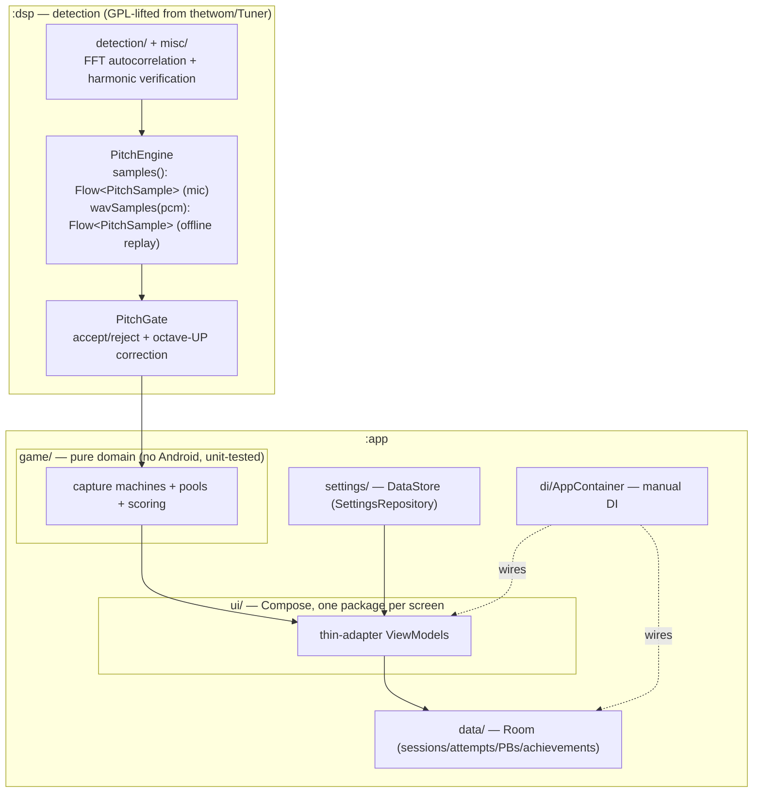
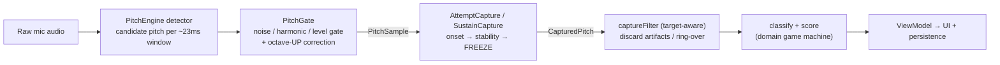
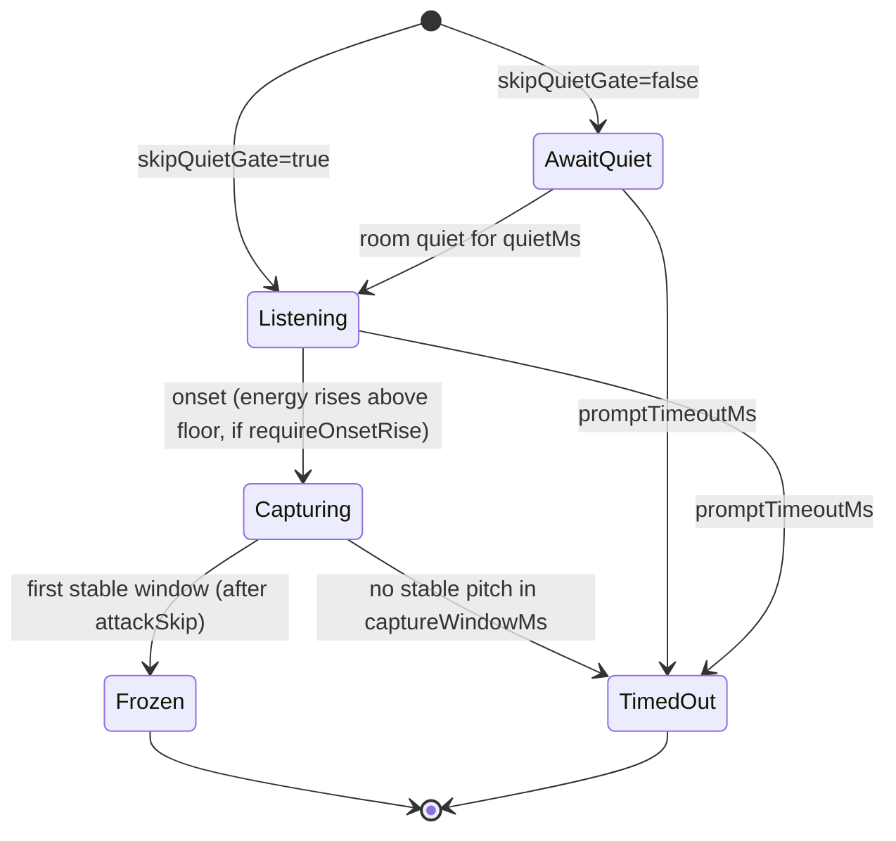
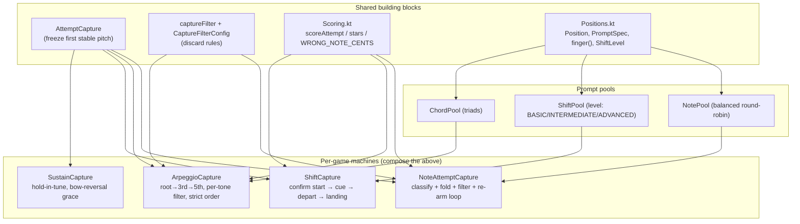
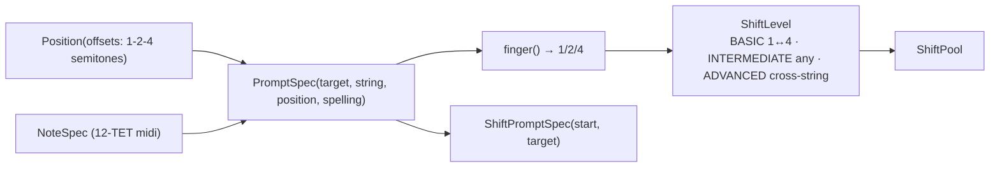
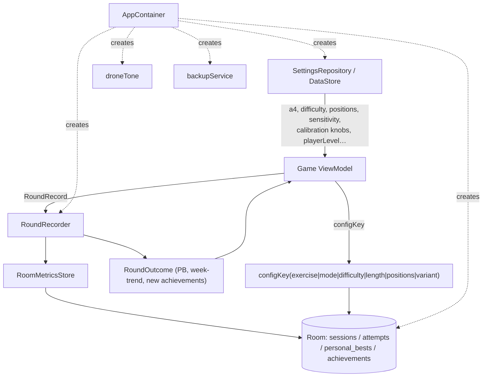
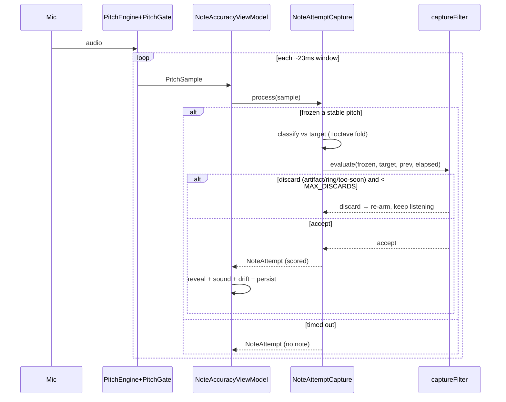

# Architecture

A map of how the Double Bass Intonation Trainer is put together: the modules, the detection
pipeline, the game domain, and how data flows from the microphone to a scored, persisted round.

- For the **capture/detection deep-dive** (problem history, thresholds, the drills) see
  [`DETECTION.md`](DETECTION.md) — this file is the structural overview; that one is the reference.
- For the **user-facing feature list** see [`../FEATURES.md`](../FEATURES.md).
- Core philosophy (never violate): **this is not a tuner.** During an exercise there is no live
  pitch readout — detect onset → wait for stability → freeze the FIRST stable pitch → score it.
  Live needles exist only on the Tune-up and Pitch-debug screens.

---

## 1. Modules and layers

Two Gradle modules. `:dsp` is pure pitch detection (Kotlin/Flow, no Android UI); `:app` is the
game domain, data, settings, and Compose UI.

**Dependency rule:** `game/` depends on `:dsp` (`PitchSample`) and `music/` only — never on Android,
settings, or UI. Target-aware and device-specific values are *passed in* (see §6). ViewModels are
thin adapters: they read settings, feed samples to a domain machine, map its result to UI state, and
handle sound / trace / persistence.

---

## 2. The detection pipeline

The app answers four questions in order. Each stage owns one class of mistake (see
[`DETECTION.md`](DETECTION.md) §0.2).

| Stage | Layer | Main job | Protects against |
|---|---|---|---|
| `PitchEngine` + detector | 1 (dsp) | estimate a candidate pitch | windows with no usable pitch |
| `PitchGate` | 1 (dsp) | reject bad windows; octave-UP fix | noise, weak signal, missing-fundamental octave errors |
| `AttemptCapture` / `SustainCapture` | 2 (domain) | did a note start; is it stable | ring-over, resonance w/o attack, unstable attack, glides |
| `captureFilter` | 3 (domain) | is the frozen note *really her attempt* | leftover ring, too-fast artifacts, harmonic misreads, unplayable/flimsy |

The three layers are kept separate on purpose: **Layer 2 (`AttemptCapture`) is target-agnostic** and
reused by every game; **Layer 3 (`captureFilter`) is target-aware** and is a single shared pure
function. (Historically Layer 3 lived inside `NoteAccuracyViewModel`; it now lives in `game/`.)

### 2.1 `AttemptCapture` — the target-agnostic capture state machine

Pure state machine; all timing is on the audio clock (sample timestamps), so it's deterministic and
unit-testable with synthetic streams. Terminal states are sticky.

Two **independent** arming flags (their decoupling is the crux of the whole detection saga, see
[`DETECTION.md`](DETECTION.md) §3):

- **`skipQuietGate`** — start in `Listening` immediately instead of waiting for silence (legato never
  goes quiet).
- **`requireOnsetRise`** — the onset must be a genuine attack (energy rising above the tracked floor),
  so a ringing/decaying note never onsets. This is what tells "she played a note" from "a note is
  still ringing."

`CapturedPitch` carries `frequencyHz`, `reactionTimeMs`, `timeToStableMs`, `quality` (CLEAN/SHAKY),
`energyLevel` (median of the frozen window), and `captureWobbleCents`. Pizz-only extras
(`octaveSettleMs`, calibrated `attackSkipMs`/`stabilityWindowMs`) handle the plucked attack — see
[`DETECTION.md`](DETECTION.md) §2.

### 2.2 `captureFilter` — the shared target-aware discard filter (Layer 3)

`game/CaptureFilter.kt` — one pure function used by every game, no copies. Given a frozen pitch and
the caller's classification, it returns the individual discard signals (so callers can still log the
trace):

| Signal | Fires when |
|---|---|
| `ringOver` | matches the previous accepted answer's pitch and isn't near the target |
| `tooSoon` | arrived before `minReadMs` (she couldn't read + play that fast) — `elapsed = MAX` disables it |
| `harmonicArtifact` | a **non-octave** integer overtone of the target (×3,5,6,7,9,10); octaves are exempt |
| `unplayable` | below `lowestPlayableHz` (a subharmonic/correction artifact) |
| `flimsy` | a wrong note that is faint (`< wrongNoteMinLevel`) or SHAKY |

Octaves (×2,×4) are deliberately *not* harmonic artifacts — a wrong octave is a real misread,
reported as "right note, wrong octave." Universal constants (`NON_OCTAVE_HARMONICS`,
`NEAR_TARGET_CENTS`, `RING_MATCH_CENTS`, `OCTAVE_TOLERANCE_CENTS`, `MAX_DISCARDS`) live here as the
single source of truth.

---

## 3. The game domain (`game/`)

Every game is a **pure state machine** that composes `AttemptCapture` and (where target-aware)
`captureFilter`, driven by a pool that draws prompts. All heavily unit-tested with synthetic
`PitchSample` scripts.

**Machine responsibilities:**

- **`NoteAttemptCapture`** (Note Accuracy) — arm (`skipQuietGate=true, requireOnsetRise=true`),
  classify the frozen pitch against the target with the octave-fold practice aid, run `captureFilter`,
  and re-arm on discard up to `MAX_DISCARDS` (or report "no note"). Emits a domain `NoteAttempt`
  (played Hz, cents, score, stars, wrongNote/wrongOctave, quality, retry count…). Ring-over is against
  the **previous prompt**; too-soon applies to any pitch.
- **`ArpeggioCapture`** (Chords) — one `AttemptCapture` per tone, same arming + `captureFilter`.
  Ring-over is against the **previous tone**; too-soon on the **root only**. Strict ascending order: a
  wrong root re-arms, a wrong 3rd/5th scores as a miss and advances.
- **`ShiftCapture`** — `ConfirmStart → HoldStart → Shift → Landing → Finished`. The **start**
  confirmation arms like Note Accuracy (fixes the "start didn't register" legato bug); the
  wrong-start re-arm stays `requireOnsetRise=false` so a legato correction is caught. The **landing**
  uses a glide filter so sliding into the note scores where the pitch *stops*; returning to the start
  re-arms. `ShiftResult` carries `confirmedStartHz` so scoring can separate the shift *distance* from
  a slightly-off start.
- **`SustainCapture`** — `AwaitQuiet → Listening → Tracking → Finished`. Requires an onset-rise (a
  ring won't start it); tracks how long the target is held in tune, forgiving a brief bow-reversal
  scoop (`outGraceMs`) but resetting on sustained drift.

### 3.1 Positions, prompts, and shift levels

Simandl mapping (confirmed against Sarah's chart): ½ = 1–3, 1st = 2–4, 2nd = 3–5, 3rd = 5–7,
4th = 7–9, 5th = 8–10 semitones above the open string. Each position spans exactly three semitones
covered by fingers 1-2-4, so `PromptSpec.finger()` = offset within the range (first→1, last→4, mid→2).

### 3.2 Scoring

- `scoreAttempt(cents, difficulty)` — 100 within ±5c, linear to 0 at the difficulty's zero point
  (RELAXED 75c / STANDARD 50c / STRICT 30c). `stars(cents)` is difficulty-independent (3/2/1/0).
- `WRONG_NOTE_CENTS` (250c) — the classifier boundary: beyond it a frozen pitch is a *different note*
  (flagged `wrongNote`, kept out of intonation/drift aggregates), not an attempt at the target. It is
  a classifier boundary, not a scoring one (points already reach 0 by 30–75c).
- `scoreShift(landCents, startCents, landingTimeMs, difficulty)` — **blended**:
  `0.7 · scoreAttempt(landCents − startCents) + 0.3 · scoreAttempt(landCents)` + a 10% fast-landing
  bonus. Credits the shift *distance* (the skill) while keeping some weight on absolute intonation.
- `DriftDetector` — median signed cents over a window; warns "trending sharp/flat" (clamped to ±60c
  so artifacts don't fake a trend).

---

## 4. Data, settings, DI

- **`configKey(...)`** is the scoring-category identity — anything that affects score comparability is
  in it (exercise, mode, difficulty, length, positions, and `variant`). For Shift the variant is the
  `ShiftLevel.id`, so each level's personal best is separate.
- **`SettingsRepository`** (DataStore) owns note-name style (solfège default), A4, difficulty, round
  length, selected positions, sound/drift toggles, `micSensitivity`, and the calibration-owned
  detection thresholds. `settings.applying(config, pizz)` is the single settings→`PitchEngineConfig`
  point.
- **`AppContainer`** is manual DI; every ViewModel has a `Factory` companion.

---

## 5. End-to-end: one prompt

How a ViewModel, a domain machine, and the detector line up for a single Note Accuracy prompt (Shift
is the same shape with an extra confirm-start/cue/depart handshake).

---

## 6. Threshold ownership (settled with the user)

Guiding principle: **calibrate what depends on the device/room/player; hard-code only true
universals.** Three homes (full detail in [`DETECTION.md`](DETECTION.md) §5):

| Home | Examples | Why |
|---|---|---|
| **Calibration wizard** → `AppSettings` | `micSensitivity`, `wrongNoteMinLevel`, `lowestPlayableHz`, pizz octave-settle/timing, octave-down knobs, mic source | depend on phone / room / instrument |
| **`PlayerLevel`** (auto-tuned by `LevelAdvisor`) | `minReadMs` (reading speed), prompt/reveal/shift timeouts | depend on the player, not the mic |
| **Universal constants** (hard-coded in `game/`) | `NON_OCTAVE_HARMONICS`, `NEAR_TARGET_CENTS`, `RING_MATCH_CENTS`, `WRONG_NOTE_CENTS` | a semitone / overtone is the same on every phone |

---

## 7. Diagnostics — traces and the corpus

- **Pitch debug screen** — live diagnostics, the real game-capture machine running live, a note-sweep
  checklist, snippet/long-capture saves.
- **Game trace** (`audio/GameTrace`, Settings → Debug "Record & trace games") — records a whole round:
  per-sample detection stream + game events (`prompt` / `result` / `discard`) + raw audio. Replay the
  WAV through `PitchEngine.wavSamples` to reconstruct detection exactly and line up decisions. This is
  the workflow for any detection issue (see [`DETECTION.md`](DETECTION.md) §9).
- **Test corpus** — real recordings in `dsp/src/test/resources/wav/` (WAV float32 + JSONL); `:app`
  tests read it via sourceSets. New detection behavior gets a regression test built from a recording.
